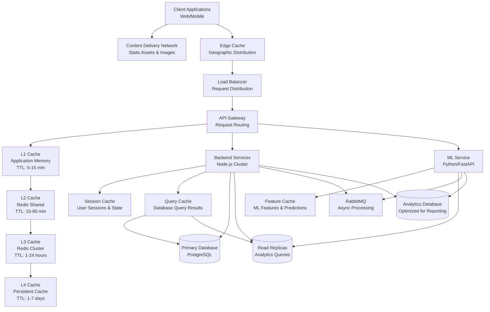

# CRM Inteligente - Performance Optimization & Cache Architecture

## Overview

This document outlines the comprehensive performance optimization strategy for CRM Inteligente, including multi-layer caching, database optimization, application-level performance enhancements, and monitoring strategies designed to handle high-volume gaming and betting workloads.

## Performance Architecture Diagram



## Multi-Layer Caching Strategy

### Cache Layer Architecture

#### L1 Cache - Application Memory (Node.js In-Memory)
```typescript
class L1Cache {
  private cache = new Map<string, CacheEntry>();
  private readonly TTL_MINUTES = {
    user_profile: 5,
    api_response: 2,
    validation_rules: 15,
    configuration: 10
  };
  
  async get<T>(key: string, type: keyof typeof this.TTL_MINUTES): Promise<T | null> {
    const entry = this.cache.get(key);
    if (!entry) return null;
    
    const ttlMs = this.TTL_MINUTES[type] * 60 * 1000;
    if (Date.now() - entry.timestamp > ttlMs) {
      this.cache.delete(key);
      return null;
    }
    
    // Update access time for LRU
    entry.lastAccess = Date.now();
    return entry.data as T;
  }
  
  async set<T>(key: string, data: T, type: keyof typeof this.TTL_MINUTES): Promise<void> {
    // Implement LRU eviction if cache is full
    if (this.cache.size >= 10000) {
      this.evictLRU();
    }
    
    this.cache.set(key, {
      data,
      timestamp: Date.now(),
      lastAccess: Date.now(),
      type
    });
  }
  
  private evictLRU(): void {
    let oldestKey = '';
    let oldestTime = Date.now();
    
    for (const [key, entry] of this.cache.entries()) {
      if (entry.lastAccess < oldestTime) {
        oldestTime = entry.lastAccess;
        oldestKey = key;
      }
    }
    
    if (oldestKey) {
      this.cache.delete(oldestKey);
    }
  }
}
```

#### L2 Cache - Redis Shared Cache
```typescript
class L2Cache {
  private redis: Redis;
  private readonly TTL_SECONDS = {
    user_sessions: 1800,      // 30 minutes
    api_responses: 900,       // 15 minutes
    ml_predictions: 3600,     // 1 hour
    campaign_data: 1800,      // 30 minutes
    transaction_summary: 600   // 10 minutes
  };
  
  async get<T>(key: string, type: keyof typeof this.TTL_SECONDS): Promise<T | null> {
    try {
      const data = await this.redis.get(this.prefixKey(key, type));
      return data ? JSON.parse(data) : null;
    } catch (error) {
      console.error('L2 Cache get error:', error);
      return null;
    }
  }
  
  async set<T>(key: string, data: T, type: keyof typeof this.TTL_SECONDS): Promise<void> {
    try {
      const prefixedKey = this.prefixKey(key, type);
      const serialized = JSON.stringify(data);
      await this.redis.setex(prefixedKey, this.TTL_SECONDS[type], serialized);
      
      // Track cache metrics
      await this.incrementMetric(`cache.l2.set.${type}`);
    } catch (error) {
      console.error('L2 Cache set error:', error);
    }
  }
  
  async invalidatePattern(pattern: string): Promise<void> {
    const keys = await this.redis.keys(pattern);
    if (keys.length > 0) {
      await this.redis.del(...keys);
    }
  }
  
  private prefixKey(key: string, type: string): string {
    return `l2:${type}:${key}`;
  }
}
```

#### L3 Cache - Redis Cluster (Distributed)
```typescript
class L3Cache {
  private cluster: RedisCluster;
  private readonly TTL_HOURS = {
    user_clusters: 6,         // 6 hours
    campaign_analytics: 24,   // 24 hours
    feature_vectors: 12,      // 12 hours
    segment_data: 8,          // 8 hours
    system_config: 24         // 24 hours
  };
  
  async get<T>(key: string, type: keyof typeof this.TTL_HOURS): Promise<T | null> {
    try {
      const pipeline = this.cluster.pipeline();
      const hashedKey = this.hashKey(key);
      
      pipeline.hgetall(`l3:${type}:${hashedKey}`);
      pipeline.ttl(`l3:${type}:${hashedKey}`);
      
      const results = await pipeline.exec();
      const [data, ttl] = results as [any[], number[]];
      
      if (!data[1] || Object.keys(data[1]).length === 0) {
        return null;
      }
      
      // Check if data is still valid
      if (ttl[1] <= 0) {
        await this.delete(key, type);
        return null;
      }
      
      return this.deserializeData(data[1]);
    } catch (error) {
      console.error('L3 Cache get error:', error);
      return null;
    }
  }
  
  async set<T>(key: string, data: T, type: keyof typeof this.TTL_HOURS): Promise<void> {
    try {
      const hashedKey = this.hashKey(key);
      const prefixedKey = `l3:${type}:${hashedKey}`;
      const serializedData = this.serializeData(data);
      const ttlSeconds = this.TTL_HOURS[type] * 3600;
      
      const pipeline = this.cluster.pipeline();
      pipeline.hmset(prefixedKey, serializedData);
      pipeline.expire(prefixedKey, ttlSeconds);
      
      await pipeline.exec();
      await this.incrementMetric(`cache.l3.set.${type}`);
    } catch (error) {
      console.error('L3 Cache set error:', error);
    }
  }
  
  private hashKey(key: string): string {
    return crypto.createHash('sha256').update(key).digest('hex').substring(0, 16);
  }
}
```

### Cache Strategies by Use Case

#### User Profile Caching
```typescript
class UserProfileCache {
  async getUserProfile(userId: string): Promise<UserProfile | null> {
    // Try L1 cache first
    let profile = await this.l1Cache.get<UserProfile>(`user:${userId}`, 'user_profile');
    if (profile) {
      this.recordCacheHit('l1', 'user_profile');
      return profile;
    }
    
    // Try L2 cache
    profile = await this.l2Cache.get<UserProfile>(`user:${userId}`, 'user_sessions');
    if (profile) {
      this.recordCacheHit('l2', 'user_profile');
      // Warm L1 cache
      await this.l1Cache.set(`user:${userId}`, profile, 'user_profile');
      return profile;
    }
    
    // Fetch from database
    profile = await this.userService.getProfile(userId);
    if (profile) {
      // Warm all cache layers
      await Promise.all([
        this.l1Cache.set(`user:${userId}`, profile, 'user_profile'),
        this.l2Cache.set(`user:${userId}`, profile, 'user_sessions')
      ]);
    }
    
    this.recordCacheMiss('user_profile');
    return profile;
  }
  
  async invalidateUserProfile(userId: string): Promise<void> {
    await Promise.all([
      this.l1Cache.delete(`user:${userId}`),
      this.l2Cache.delete(`user:${userId}`),
      this.l3Cache.delete(`user:${userId}`, 'user_clusters')
    ]);
  }
}
```

#### ML Feature Caching
```typescript
class MLFeatureCache {
  async getUserFeatures(userId: string, timeWindow: number = 30): Promise<UserFeatures | null> {
    const cacheKey = `features:${userId}:${timeWindow}d`;
    
    // Check L3 cache for feature vectors (longer TTL)
    let features = await this.l3Cache.get<UserFeatures>(cacheKey, 'feature_vectors');
    if (features) {
      this.recordCacheHit('l3', 'ml_features');
      return features;
    }
    
    // Compute features if not cached
    features = await this.mlService.computeUserFeatures(userId, timeWindow);
    if (features) {
      // Cache for 12 hours
      await this.l3Cache.set(cacheKey, features, 'feature_vectors');
    }
    
    this.recordCacheMiss('ml_features');
    return features;
  }
  
  async precomputeFeatures(userIds: string[]): Promise<void> {
    // Batch precompute features for high-value users
    const batch = userIds.slice(0, 100); // Process in batches
    
    const featurePromises = batch.map(async (userId) => {
      const features = await this.mlService.computeUserFeatures(userId, 30);
      if (features) {
        await this.l3Cache.set(`features:${userId}:30d`, features, 'feature_vectors');
      }
    });
    
    await Promise.all(featurePromises);
  }
}
```

#### Query Result Caching
```typescript
class QueryCache {
  async getCachedQuery<T>(
    queryKey: string, 
    queryFn: () => Promise<T>,
    ttlMinutes: number = 15
  ): Promise<T> {
    
    // Check L2 cache for query results
    let result = await this.l2Cache.get<T>(queryKey, 'api_responses');
    if (result) {
      this.recordCacheHit('l2', 'query');
      return result;
    }
    
    // Execute query and cache result
    result = await queryFn();
    if (result) {
      await this.l2Cache.set(queryKey, result, 'api_responses');
    }
    
    this.recordCacheMiss('query');
    return result;
  }
  
  async getTransactionSummary(userId: string, days: number = 30): Promise<TransactionSummary> {
    const cacheKey = `tx_summary:${userId}:${days}d`;
    
    return this.getCachedQuery(
      cacheKey,
      () => this.transactionService.getSummary(userId, days),
      30 // Cache for 30 minutes
    );
  }
  
  async getCampaignAnalytics(campaignId: string): Promise<CampaignAnalytics> {
    const cacheKey = `campaign_analytics:${campaignId}`;
    
    return this.getCachedQuery(
      cacheKey,
      () => this.campaignService.getAnalytics(campaignId),
      60 // Cache for 1 hour
    );
  }
}
```

## Database Performance Optimization

### Query Optimization Strategies

#### Index Strategy Implementation
```sql
-- Composite indexes for common query patterns
CREATE INDEX CONCURRENTLY idx_user_activity_analysis ON user_transactions(
    user_id, 
    timestamp DESC, 
    transaction_type, 
    amount
) WHERE status = 'completed';

-- Partial indexes for filtered queries
CREATE INDEX CONCURRENTLY idx_high_value_transactions ON user_transactions(
    user_id, 
    timestamp DESC, 
    amount
) WHERE amount >= 1000.00 AND status = 'completed';

-- Expression indexes for computed values
CREATE INDEX CONCURRENTLY idx_transaction_hour ON user_transactions(
    user_id,
    EXTRACT(hour FROM timestamp),
    transaction_type
) WHERE status = 'completed';

-- GIN indexes for array and JSONB searches
CREATE INDEX CONCURRENTLY idx_user_preferred_games ON users 
USING gin(preferred_games) 
WHERE preferred_games IS NOT NULL;

CREATE INDEX CONCURRENTLY idx_cluster_features ON user_clusters 
USING gin(features) 
WHERE is_current = true;
```

#### Connection Pooling Configuration
```typescript
class DatabasePool {
  private pool: Pool;
  
  constructor() {
    this.pool = new Pool({
      host: process.env.DB_HOST,
      port: parseInt(process.env.DB_PORT || '5432'),
      database: process.env.DB_NAME,
      user: process.env.DB_USER,
      password: process.env.DB_PASSWORD,
      
      // Connection pool settings
      min: 10,                    // Minimum connections
      max: 100,                   // Maximum connections
      acquireTimeoutMillis: 30000, // 30 seconds
      idleTimeoutMillis: 600000,   // 10 minutes
      reapIntervalMillis: 1000,    // 1 second
      createRetryIntervalMillis: 2000,
      
      // Performance settings
      statement_timeout: 30000,    // 30 seconds
      query_timeout: 30000,        // 30 seconds
      connectionTimeoutMillis: 5000, // 5 seconds
    });
    
    // Monitor pool health
    this.setupPoolMonitoring();
  }
  
  private setupPoolMonitoring(): void {
    setInterval(() => {
      const stats = {
        totalCount: this.pool.totalCount,
        idleCount: this.pool.idleCount,
        waitingCount: this.pool.waitingCount
      };
      
      // Send metrics to monitoring system
      this.sendMetrics('database.pool', stats);
      
      // Alert if pool is under stress
      if (stats.waitingCount > 10) {
        this.alertPoolStress(stats);
      }
    }, 10000); // Every 10 seconds
  }
}
```

#### Read Replica Strategy
```typescript
class DatabaseRouter {
  private primary: Pool;
  private replicas: Pool[];
  private replicaIndex = 0;
  
  async query(sql: string, params: any[], options: QueryOptions = {}): Promise<any> {
    const isReadQuery = this.isReadOnlyQuery(sql);
    const forceMain = options.forcePrimary || this.isInTransaction();
    
    if (isReadQuery && !forceMain) {
      return this.queryReplica(sql, params);
    }
    
    return this.queryPrimary(sql, params);
  }
  
  private async queryReplica(sql: string, params: any[]): Promise<any> {
    // Round-robin load balancing across read replicas
    const replica = this.replicas[this.replicaIndex % this.replicas.length];
    this.replicaIndex++;
    
    try {
      const startTime = Date.now();
      const result = await replica.query(sql, params);
      
      // Record performance metrics
      this.recordQueryMetrics('replica', Date.now() - startTime, sql);
      return result;
    } catch (error) {
      // Fallback to primary on replica failure
      console.warn('Replica query failed, falling back to primary:', error);
      return this.queryPrimary(sql, params);
    }
  }
  
  private isReadOnlyQuery(sql: string): boolean {
    const readPatterns = /^\s*(SELECT|WITH)/i;
    const writePatterns = /\b(INSERT|UPDATE|DELETE|CREATE|DROP|ALTER|TRUNCATE)\b/i;
    
    return readPatterns.test(sql) && !writePatterns.test(sql);
  }
}
```

### Data Partitioning Strategy

#### Time-based Partitioning
```sql
-- Partition user_transactions by month
CREATE TABLE user_transactions_y2024m01 PARTITION OF user_transactions
FOR VALUES FROM ('2024-01-01') TO ('2024-02-01');

CREATE TABLE user_transactions_y2024m02 PARTITION OF user_transactions
FOR VALUES FROM ('2024-02-01') TO ('2024-03-01');

-- Automatic partition creation function
CREATE OR REPLACE FUNCTION create_monthly_partition(
    table_name text,
    start_date date
) RETURNS void AS $$
DECLARE
    partition_name text;
    end_date date;
BEGIN
    partition_name := table_name || '_y' || EXTRACT(year FROM start_date) || 
                     'm' || LPAD(EXTRACT(month FROM start_date)::text, 2, '0');
    end_date := start_date + INTERVAL '1 month';
    
    EXECUTE format('CREATE TABLE %I PARTITION OF %I 
                   FOR VALUES FROM (%L) TO (%L)',
                   partition_name, table_name, start_date, end_date);
    
    -- Create indexes on the new partition
    EXECUTE format('CREATE INDEX %I ON %I (user_id, timestamp DESC)',
                   partition_name || '_user_time_idx', partition_name);
END;
$$ LANGUAGE plpgsql;

-- Schedule partition creation
SELECT cron.schedule('create-partitions', '0 0 1 * *', 
    'SELECT create_monthly_partition(''user_transactions'', date_trunc(''month'', CURRENT_DATE + INTERVAL ''1 month''))');
```

## Application-Level Performance Optimization

### Asynchronous Processing Patterns

#### Message Queue Implementation
```typescript
class AsyncProcessor {
  private publisher: Channel;
  private consumer: Channel;
  
  async processUserEvent(event: UserEvent): Promise<void> {
    // Immediate response to client
    const eventId = uuid.v4();
    
    // Queue for async processing
    await this.publisher.sendToQueue('user.events', Buffer.from(JSON.stringify({
      eventId,
      ...event,
      timestamp: new Date().toISOString()
    })), {
      persistent: true,
      priority: this.getEventPriority(event.type)
    });
    
    // Return immediately
    return;
  }
  
  async setupConsumers(): Promise<void> {
    // ML feature update consumer
    await this.consumer.consume('user.events', async (msg) => {
      if (msg) {
        const event = JSON.parse(msg.content.toString());
        
        try {
          await this.processMLUpdate(event);
          this.consumer.ack(msg);
        } catch (error) {
          // Retry logic with exponential backoff
          await this.handleProcessingError(msg, error);
        }
      }
    }, { noAck: false });
    
    // Campaign trigger consumer
    await this.consumer.consume('campaign.triggers', async (msg) => {
      if (msg) {
        const trigger = JSON.parse(msg.content.toString());
        await this.processCampaignTrigger(trigger);
        this.consumer.ack(msg);
      }
    });
  }
  
  private getEventPriority(eventType: string): number {
    const priorities = {
      'transaction.completed': 5,
      'user.login': 3,
      'user.profile.updated': 2,
      'user.activity': 1
    };
    return priorities[eventType] || 1;
  }
}
```

#### Batch Processing Optimization
```typescript
class BatchProcessor {
  private batchSize = 1000;
  private batchTimeout = 30000; // 30 seconds
  private pendingBatch: any[] = [];
  private batchTimer: NodeJS.Timeout | null = null;
  
  async addToBatch(item: any, processor: string): Promise<void> {
    this.pendingBatch.push({ item, processor, timestamp: Date.now() });
    
    // Process batch if size limit reached
    if (this.pendingBatch.length >= this.batchSize) {
      await this.processBatch();
    }
    
    // Set timeout for partial batches
    if (!this.batchTimer) {
      this.batchTimer = setTimeout(() => {
        this.processBatch();
      }, this.batchTimeout);
    }
  }
  
  private async processBatch(): Promise<void> {
    if (this.pendingBatch.length === 0) return;
    
    const batch = this.pendingBatch.splice(0, this.batchSize);
    if (this.batchTimer) {
      clearTimeout(this.batchTimer);
      this.batchTimer = null;
    }
    
    // Group by processor type
    const processorGroups = batch.reduce((groups, { item, processor }) => {
      if (!groups[processor]) groups[processor] = [];
      groups[processor].push(item);
      return groups;
    }, {} as Record<string, any[]>);
    
    // Process each group
    const promises = Object.entries(processorGroups).map(([processor, items]) => {
      return this.processorMap[processor](items);
    });
    
    try {
      await Promise.all(promises);
      this.recordBatchMetrics(batch.length, Date.now() - batch[0].timestamp);
    } catch (error) {
      console.error('Batch processing error:', error);
      // Implement retry logic
      await this.retryFailedBatch(batch);
    }
  }
  
  private processorMap = {
    'ml_features': async (items: any[]) => {
      const userIds = items.map(item => item.userId);
      await this.mlService.batchUpdateFeatures(userIds);
    },
    
    'user_analytics': async (items: any[]) => {
      const events = items.map(item => item.event);
      await this.analyticsService.batchProcessEvents(events);
    },
    
    'email_delivery': async (items: any[]) => {
      const emails = items.map(item => item.email);
      await this.emailService.batchSendEmails(emails);
    }
  };
}
```

### Memory Management & Optimization

#### Memory-Efficient Data Structures
```typescript
class MemoryOptimizedCache {
  private cache = new Map<string, WeakRef<CacheEntry>>();
  private finalizationRegistry = new FinalizationRegistry((key: string) => {
    this.cache.delete(key);
  });
  
  set(key: string, value: any, ttl: number): void {
    const entry: CacheEntry = {
      value,
      expires: Date.now() + ttl,
      size: this.estimateSize(value)
    };
    
    const weakRef = new WeakRef(entry);
    this.cache.set(key, weakRef);
    
    // Register for cleanup when entry is garbage collected
    this.finalizationRegistry.register(entry, key);
    
    // Update memory usage metrics
    this.updateMemoryMetrics(entry.size, 'add');
  }
  
  get(key: string): any | null {
    const weakRef = this.cache.get(key);
    if (!weakRef) return null;
    
    const entry = weakRef.deref();
    if (!entry || Date.now() > entry.expires) {
      this.cache.delete(key);
      return null;
    }
    
    return entry.value;
  }
  
  private estimateSize(obj: any): number {
    return JSON.stringify(obj).length * 2; // Rough estimate
  }
}
```

#### Stream Processing for Large Datasets
```typescript
class StreamProcessor {
  async processLargeDataset(dataSource: string, processor: (chunk: any[]) => Promise<void>): Promise<void> {
    const stream = new Transform({
      objectMode: true,
      transform(chunk, encoding, callback) {
        // Process data in streaming fashion
        callback(null, chunk);
      }
    });
    
    const chunkSize = 1000;
    let buffer: any[] = [];
    
    stream.on('data', async (data) => {
      buffer.push(data);
      
      if (buffer.length >= chunkSize) {
        await processor(buffer);
        buffer = [];
        
        // Yield control to event loop
        await new Promise(resolve => setImmediate(resolve));
      }
    });
    
    stream.on('end', async () => {
      if (buffer.length > 0) {
        await processor(buffer);
      }
    });
    
    // Create readable stream from data source
    const readable = this.createReadableStream(dataSource);
    readable.pipe(stream);
  }
  
  async processUserTransactions(userId: string): Promise<void> {
    await this.processLargeDataset(
      `transactions:${userId}`,
      async (transactions) => {
        // Process chunk of transactions
        const features = await this.extractFeatures(transactions);
        await this.updateUserFeatures(userId, features);
      }
    );
  }
}
```

## Performance Monitoring & Metrics

### Real-Time Performance Monitoring

#### Comprehensive Metrics Collection
```typescript
class PerformanceMonitor {
  private metrics = new Map<string, MetricData>();
  
  // API Response Time Monitoring
  trackAPIPerformance(endpoint: string, method: string, responseTime: number, statusCode: number): void {
    const key = `api.${method}.${endpoint}`;
    
    this.updateMetric(key, {
      responseTime,
      timestamp: Date.now(),
      statusCode,
      count: 1
    });
    
    // Alert on high response times
    if (responseTime > 1000) {
      this.alertSlowResponse(endpoint, method, responseTime);
    }
  }
  
  // Database Query Performance
  trackQueryPerformance(query: string, duration: number, rows: number): void {
    const queryHash = this.hashQuery(query);
    const key = `db.query.${queryHash}`;
    
    this.updateMetric(key, {
      duration,
      rows,
      timestamp: Date.now(),
      count: 1
    });
  }
  
  // Cache Performance Metrics
  trackCachePerformance(layer: string, operation: string, hit: boolean): void {
    const key = `cache.${layer}.${operation}`;
    
    this.updateMetric(key, {
      hits: hit ? 1 : 0,
      misses: hit ? 0 : 1,
      total: 1,
      timestamp: Date.now()
    });
  }
  
  // ML Model Performance
  trackMLPerformance(model: string, predictionTime: number, accuracy?: number): void {
    const key = `ml.${model}`;
    
    this.updateMetric(key, {
      predictionTime,
      accuracy: accuracy || 0,
      timestamp: Date.now(),
      count: 1
    });
  }
  
  // System Resource Monitoring
  async collectSystemMetrics(): Promise<void> {
    const usage = process.memoryUsage();
    const cpuUsage = process.cpuUsage();
    
    this.updateMetric('system.memory', {
      heapUsed: usage.heapUsed,
      heapTotal: usage.heapTotal,
      external: usage.external,
      rss: usage.rss,
      timestamp: Date.now()
    });
    
    this.updateMetric('system.cpu', {
      user: cpuUsage.user,
      system: cpuUsage.system,
      timestamp: Date.now()
    });
    
    // Alert on high resource usage
    if (usage.heapUsed / usage.heapTotal > 0.85) {
      this.alertHighMemoryUsage(usage);
    }
  }
  
  // Generate Performance Report
  generatePerformanceReport(timeRange: number = 3600000): PerformanceReport {
    const now = Date.now();
    const cutoff = now - timeRange;
    
    const report: PerformanceReport = {
      timeRange: timeRange / 1000 / 60, // minutes
      apiMetrics: this.getAPIMetrics(cutoff),
      dbMetrics: this.getDBMetrics(cutoff),
      cacheMetrics: this.getCacheMetrics(cutoff),
      mlMetrics: this.getMLMetrics(cutoff),
      systemMetrics: this.getSystemMetrics(cutoff),
      alerts: this.getRecentAlerts(cutoff)
    };
    
    return report;
  }
}
```

### Performance Optimization Triggers

#### Automatic Optimization
```typescript
class AutoOptimizer {
  private optimizationRules: OptimizationRule[] = [
    {
      condition: (metrics) => metrics.api.p95ResponseTime > 500,
      action: () => this.scaleAPIInstances(),
      description: 'Scale API instances on high response time'
    },
    {
      condition: (metrics) => metrics.cache.hitRate < 0.7,
      action: () => this.optimizeCacheStrategy(),
      description: 'Optimize cache strategy on low hit rate'
    },
    {
      condition: (metrics) => metrics.db.connectionPool.usage > 0.8,
      action: () => this.scaleDBConnections(),
      description: 'Scale database connections on high usage'
    },
    {
      condition: (metrics) => metrics.ml.predictionLatency > 100,
      action: () => this.optimizeMLPipeline(),
      description: 'Optimize ML pipeline on high latency'
    }
  ];
  
  async runOptimizationCycle(): Promise<void> {
    const metrics = await this.gatherMetrics();
    
    for (const rule of this.optimizationRules) {
      if (rule.condition(metrics)) {
        console.log(`Triggering optimization: ${rule.description}`);
        await rule.action();
        
        // Log optimization action
        await this.auditLog('OPTIMIZATION_TRIGGERED', {
          rule: rule.description,
          metrics: metrics,
          timestamp: new Date()
        });
      }
    }
  }
  
  private async scaleAPIInstances(): Promise<void> {
    // Implement auto-scaling logic
    const currentInstances = await this.getCurrentInstanceCount();
    const targetInstances = Math.min(currentInstances * 1.5, 20);
    
    await this.scaleInstances(targetInstances);
  }
  
  private async optimizeCacheStrategy(): Promise<void> {
    // Analyze cache patterns and adjust TTLs
    const cacheAnalysis = await this.analyzeCachePatterns();
    
    if (cacheAnalysis.lowHitRateKeys.length > 0) {
      // Increase TTL for frequently missed keys
      await this.adjustCacheTTLs(cacheAnalysis.lowHitRateKeys, 'increase');
    }
    
    if (cacheAnalysis.staleCachedKeys.length > 0) {
      // Decrease TTL for stale data
      await this.adjustCacheTTLs(cacheAnalysis.staleCachedKeys, 'decrease');
    }
  }
}
```

## Performance Testing & Benchmarking

### Load Testing Configuration
```typescript
class LoadTester {
  async runPerformanceTests(): Promise<TestResults> {
    const scenarios = [
      {
        name: 'User Registration Load',
        concurrent: 100,
        duration: 300, // 5 minutes
        endpoint: '/auth/register',
        method: 'POST'
      },
      {
        name: 'Transaction Processing',
        concurrent: 500,
        duration: 600, // 10 minutes
        endpoint: '/transactions',
        method: 'POST'
      },
      {
        name: 'ML Prediction Load',
        concurrent: 50,
        duration: 300,
        endpoint: '/ml/predictions',
        method: 'POST'
      },
      {
        name: 'Campaign Analytics',
        concurrent: 200,
        duration: 300,
        endpoint: '/analytics/campaigns',
        method: 'GET'
      }
    ];
    
    const results = await Promise.all(
      scenarios.map(scenario => this.runScenario(scenario))
    );
    
    return this.aggregateResults(results);
  }
  
  private async runScenario(scenario: LoadTestScenario): Promise<ScenarioResult> {
    const startTime = Date.now();
    const requests: RequestResult[] = [];
    
    // Simulate concurrent users
    const promises = Array.from({ length: scenario.concurrent }, async (_, i) => {
      const userSession = await this.createUserSession();
      
      while (Date.now() - startTime < scenario.duration * 1000) {
        const requestStart = Date.now();
        
        try {
          const response = await this.makeRequest(scenario, userSession);
          requests.push({
            responseTime: Date.now() - requestStart,
            statusCode: response.status,
            success: response.status < 400
          });
        } catch (error) {
          requests.push({
            responseTime: Date.now() - requestStart,
            statusCode: 500,
            success: false,
            error: error.message
          });
        }
        
        // Wait between requests
        await this.sleep(100 + Math.random() * 900); // 100-1000ms
      }
    });
    
    await Promise.all(promises);
    
    return this.analyzeScenarioResults(scenario.name, requests);
  }
}
```

This comprehensive performance optimization and caching architecture ensures that CRM Inteligente can handle high-volume gaming and betting workloads while maintaining sub-second response times and optimal resource utilization. The multi-layer caching strategy, database optimizations, and real-time monitoring provide a robust foundation for scalable performance.