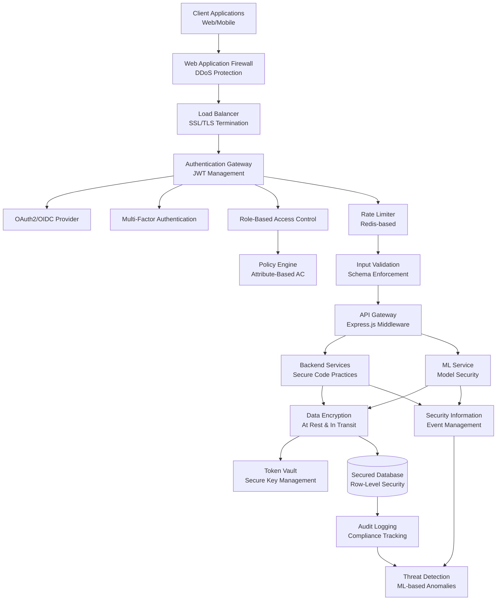

# CRM Inteligente - Security & Authentication Architecture

## Overview

This document outlines the comprehensive security architecture for CRM Inteligente, covering authentication, authorization, data protection, and security monitoring. The system is designed to meet enterprise-grade security requirements for gaming and betting platforms, including regulatory compliance (LGPD, GDPR) and industry best practices.

## Security Architecture Diagram



## Authentication Architecture

### JWT Implementation

#### Token Structure
```typescript
interface JWTPayload {
  // Standard JWT claims
  iss: string;           // Issuer (crmbet.com)
  sub: string;           // Subject (user ID)
  aud: string;           // Audience (api.crmbet.com)
  exp: number;           // Expiration timestamp
  iat: number;           // Issued at timestamp
  jti: string;           // JWT ID (for blacklisting)
  
  // Custom claims
  userId: string;        // UUID of the user
  email: string;         // User email (hashed)
  roles: string[];       // User roles
  permissions: string[]; // Specific permissions
  sessionId: string;     // Session identifier
  deviceId?: string;     // Device fingerprint
  ipAddress?: string;    // Client IP (hashed)
  
  // Security claims
  authLevel: number;     // Authentication strength (1-5)
  mfaVerified: boolean;  // MFA completion status
  riskScore: number;     // Session risk score (0-100)
}
```

#### Token Management Strategy
```typescript
class TokenManager {
  // Access token: Short-lived (15 minutes)
  generateAccessToken(user: User): string {
    return jwt.sign({
      sub: user.id,
      email: hashEmail(user.email),
      roles: user.roles,
      permissions: this.getUserPermissions(user),
      sessionId: generateSessionId(),
      authLevel: user.authLevel,
      mfaVerified: user.mfaEnabled && user.mfaVerified,
      riskScore: this.calculateRiskScore(user)
    }, process.env.JWT_SECRET, {
      expiresIn: '15m',
      issuer: 'crmbet.com',
      audience: 'api.crmbet.com'
    });
  }
  
  // Refresh token: Long-lived (7 days), single-use
  generateRefreshToken(userId: string): string {
    return jwt.sign({
      sub: userId,
      tokenType: 'refresh',
      sessionId: generateSessionId()
    }, process.env.JWT_REFRESH_SECRET, {
      expiresIn: '7d'
    });
  }
  
  // Token blacklisting for logout/security events
  async blacklistToken(jti: string): Promise<void> {
    await redis.setex(`blacklist:${jti}`, 900, 'revoked'); // 15 min TTL
  }
}
```

### Multi-Factor Authentication (MFA)

#### MFA Methods Supported
1. **TOTP (Time-based One-Time Password)**: Google Authenticator, Authy
2. **SMS**: Encrypted SMS delivery
3. **Email**: Secure email codes
4. **Hardware Keys**: FIDO2/WebAuthn support

#### MFA Implementation
```typescript
class MFAService {
  async setupTOTP(userId: string): Promise<{ secret: string, qrCode: string }> {
    const secret = speakeasy.generateSecret({
      name: `CRMBet (${user.email})`,
      issuer: 'CRMBet'
    });
    
    await this.storeMFASecret(userId, secret.base32);
    return {
      secret: secret.base32,
      qrCode: qrcode.toDataURL(secret.otpauth_url)
    };
  }
  
  async verifyTOTP(userId: string, token: string): Promise<boolean> {
    const secret = await this.getMFASecret(userId);
    return speakeasy.totp.verify({
      secret,
      token,
      window: 2, // Allow 2 time steps variance
      encoding: 'base32'
    });
  }
  
  async requireMFA(user: User): Promise<boolean> {
    // MFA required for:
    // - Admin users
    // - High-value transactions
    // - Suspicious activity
    // - Configuration changes
    return user.isAdmin || 
           user.riskScore > 50 || 
           user.hasHighValueTransactions ||
           this.detectSuspiciousActivity(user);
  }
}
```

### OAuth2/OIDC Integration

#### Supported Providers
- Google OAuth2
- Facebook Login
- Apple Sign In
- Custom Enterprise SSO

#### OAuth Implementation
```typescript
class OAuthService {
  async handleGoogleAuth(authCode: string): Promise<AuthResult> {
    // Exchange authorization code for tokens
    const tokens = await this.exchangeCodeForTokens('google', authCode);
    
    // Verify and extract user info
    const userInfo = await this.verifyGoogleToken(tokens.id_token);
    
    // Find or create user
    let user = await this.findUserByEmail(userInfo.email);
    if (!user) {
      user = await this.createOAuthUser({
        email: userInfo.email,
        name: userInfo.name,
        provider: 'google',
        providerId: userInfo.sub,
        emailVerified: userInfo.email_verified
      });
    }
    
    // Generate our JWT tokens
    return this.generateAuthTokens(user);
  }
}
```

## Authorization Architecture

### Role-Based Access Control (RBAC)

#### Role Hierarchy
```typescript
enum UserRole {
  SUPER_ADMIN = 'super_admin',    // Full system access
  ADMIN = 'admin',                // User & campaign management
  ANALYST = 'analyst',            // Read-only analytics
  MARKETER = 'marketer',          // Campaign creation/management
  SUPPORT = 'support',            // Limited user support
  API_USER = 'api_user',          // Service-to-service
  USER = 'user'                   // Regular user
}

interface Permission {
  resource: string;               // e.g., 'users', 'campaigns', 'analytics'
  action: string;                 // e.g., 'read', 'write', 'delete', 'execute'
  conditions?: PermissionCondition[];
}

interface PermissionCondition {
  type: 'owner' | 'timeWindow' | 'valueLimit' | 'geoRestriction';
  value: any;
}
```

#### Permission Matrix
```typescript
const ROLE_PERMISSIONS: Record<UserRole, Permission[]> = {
  [UserRole.SUPER_ADMIN]: [
    { resource: '*', action: '*' }  // Full access
  ],
  
  [UserRole.ADMIN]: [
    { resource: 'users', action: '*' },
    { resource: 'campaigns', action: '*' },
    { resource: 'analytics', action: 'read' },
    { resource: 'ml', action: 'read' },
    { resource: 'system', action: 'read' }
  ],
  
  [UserRole.ANALYST]: [
    { resource: 'users', action: 'read' },
    { resource: 'transactions', action: 'read' },
    { resource: 'campaigns', action: 'read' },
    { resource: 'analytics', action: 'read' },
    { resource: 'ml', action: 'read' }
  ],
  
  [UserRole.MARKETER]: [
    { resource: 'campaigns', action: '*' },
    { resource: 'users', action: 'read', conditions: [
      { type: 'valueLimit', value: { field: 'pii', allowed: false } }
    ]},
    { resource: 'analytics', action: 'read', conditions: [
      { type: 'timeWindow', value: { hours: 168 } } // Last 7 days
    ]}
  ],
  
  [UserRole.USER]: [
    { resource: 'profile', action: '*', conditions: [
      { type: 'owner', value: true }
    ]},
    { resource: 'transactions', action: 'read', conditions: [
      { type: 'owner', value: true }
    ]}
  ]
};
```

### Attribute-Based Access Control (ABAC)

#### Policy Engine
```typescript
class PolicyEngine {
  async evaluateAccess(
    subject: User,
    resource: string,
    action: string,
    context: AccessContext
  ): Promise<AccessDecision> {
    
    const policies = await this.getPoliciesForResource(resource);
    
    for (const policy of policies) {
      const decision = await this.evaluatePolicy(policy, {
        subject,
        resource,
        action,
        context
      });
      
      if (decision.effect === 'DENY') {
        return decision; // Explicit deny overrides
      }
    }
    
    return { effect: 'PERMIT', reason: 'Policy evaluation passed' };
  }
  
  private async evaluatePolicy(
    policy: Policy,
    request: AccessRequest
  ): Promise<AccessDecision> {
    
    // Evaluate subject attributes
    if (!this.matchesSubjectConditions(policy.subject, request.subject)) {
      return { effect: 'NOT_APPLICABLE' };
    }
    
    // Evaluate resource attributes
    if (!this.matchesResourceConditions(policy.resource, request.resource)) {
      return { effect: 'NOT_APPLICABLE' };
    }
    
    // Evaluate action constraints
    if (!this.matchesActionConditions(policy.action, request.action)) {
      return { effect: 'NOT_APPLICABLE' };
    }
    
    // Evaluate contextual conditions
    if (!this.matchesContextConditions(policy.context, request.context)) {
      return { effect: 'DENY', reason: 'Context conditions not met' };
    }
    
    return { effect: policy.effect, reason: policy.description };
  }
}
```

## Data Protection & Encryption

### Encryption Standards

#### Data at Rest
```typescript
class DataEncryption {
  // AES-256-GCM for sensitive data
  async encryptSensitiveData(data: string, context: string): Promise<EncryptedData> {
    const key = await this.getEncryptionKey(context);
    const iv = crypto.randomBytes(16);
    const cipher = crypto.createCipher('aes-256-gcm', key);
    
    cipher.setAAD(Buffer.from(context));
    let encrypted = cipher.update(data, 'utf8', 'hex');
    encrypted += cipher.final('hex');
    
    const authTag = cipher.getAuthTag();
    
    return {
      encrypted,
      iv: iv.toString('hex'),
      authTag: authTag.toString('hex'),
      algorithm: 'aes-256-gcm'
    };
  }
  
  // Field-level encryption for PII
  async encryptPII(piiData: PIIData): Promise<EncryptedPIIData> {
    return {
      email: await this.encryptField(piiData.email, 'email'),
      phone: await this.encryptField(piiData.phone, 'phone'),
      name: await this.encryptField(piiData.name, 'name'),
      // Keep search hashes for functionality
      emailHash: this.createSearchHash(piiData.email),
      phoneHash: this.createSearchHash(piiData.phone)
    };
  }
}
```

#### Data in Transit
- **TLS 1.3**: All external communications
- **Certificate Pinning**: Mobile applications
- **Perfect Forward Secrecy**: Ephemeral key exchange
- **HSTS**: HTTP Strict Transport Security

#### Key Management
```typescript
class KeyManagementService {
  private keyRotationSchedule = {
    jwt_signing: '30d',      // JWT signing keys
    encryption: '90d',       // Data encryption keys
    api_keys: '180d',       // API access keys
    session_keys: '24h'      // Session encryption keys
  };
  
  async rotateKeys(): Promise<void> {
    for (const [keyType, interval] of Object.entries(this.keyRotationSchedule)) {
      const lastRotation = await this.getLastRotation(keyType);
      if (this.shouldRotate(lastRotation, interval)) {
        await this.performKeyRotation(keyType);
        await this.auditLog('KEY_ROTATION', { keyType, timestamp: new Date() });
      }
    }
  }
  
  async getEncryptionKey(context: string): Promise<Buffer> {
    // Use key derivation based on context
    const masterKey = await this.getMasterKey();
    return crypto.pbkdf2Sync(masterKey, context, 10000, 32, 'sha256');
  }
}
```

### PII Protection Strategy

#### Data Classification
```typescript
enum DataClassification {
  PUBLIC = 'public',          // No protection needed
  INTERNAL = 'internal',      // Internal use only
  CONFIDENTIAL = 'confidential', // Encrypted storage
  RESTRICTED = 'restricted'   // Highest protection
}

interface DataField {
  name: string;
  classification: DataClassification;
  retention: number;          // Days to retain
  anonymization: boolean;     // Can be anonymized
  encryption: boolean;        // Must be encrypted
}

const USER_DATA_FIELDS: DataField[] = [
  { name: 'email', classification: DataClassification.CONFIDENTIAL, retention: 2555, anonymization: true, encryption: true },
  { name: 'phone', classification: DataClassification.CONFIDENTIAL, retention: 2555, anonymization: true, encryption: true },
  { name: 'name', classification: DataClassification.CONFIDENTIAL, retention: 2555, anonymization: true, encryption: true },
  { name: 'ip_address', classification: DataClassification.RESTRICTED, retention: 90, anonymization: true, encryption: true },
  { name: 'device_fingerprint', classification: DataClassification.INTERNAL, retention: 365, anonymization: true, encryption: false },
  { name: 'transaction_amount', classification: DataClassification.CONFIDENTIAL, retention: 2555, anonymization: false, encryption: true }
];
```

#### Data Anonymization
```typescript
class DataAnonymization {
  async anonymizeUser(userId: string): Promise<void> {
    // Hash-based anonymization preserving analytics utility
    const salt = crypto.randomBytes(16);
    
    await this.updateUser(userId, {
      name: this.hashField('name', userId, salt),
      email: this.hashField('email', userId, salt),
      phone: this.hashField('phone', userId, salt),
      ip_addresses: null, // Remove IP history
      device_fingerprints: null, // Remove device history
      anonymized_at: new Date(),
      anonymized: true
    });
    
    // Preserve transaction patterns but remove identifiable info
    await this.anonymizeTransactionData(userId, salt);
  }
  
  private hashField(field: string, userId: string, salt: Buffer): string {
    return crypto.pbkdf2Sync(`${field}:${userId}`, salt, 10000, 16, 'sha256').toString('hex');
  }
}
```

## Security Monitoring & Threat Detection

### Real-time Threat Detection

#### Anomaly Detection
```typescript
class ThreatDetectionService {
  private readonly suspiciousPatterns = [
    'rapid_login_attempts',
    'unusual_transaction_pattern',
    'geographic_anomaly',
    'device_fingerprint_mismatch',
    'api_abuse_pattern',
    'privilege_escalation_attempt'
  ];
  
  async analyzeUserBehavior(userId: string, action: UserAction): Promise<ThreatAssessment> {
    const userProfile = await this.getUserBehaviorProfile(userId);
    const riskFactors: RiskFactor[] = [];
    
    // Geographic anomaly detection
    if (this.isGeographicAnomaly(userProfile, action)) {
      riskFactors.push({
        type: 'geographic_anomaly',
        severity: 'medium',
        confidence: 0.8,
        details: { 
          usual_country: userProfile.usual_country,
          current_country: action.country 
        }
      });
    }
    
    // Behavioral pattern analysis
    if (this.isBehavioralAnomaly(userProfile, action)) {
      riskFactors.push({
        type: 'behavioral_anomaly',
        severity: 'high',
        confidence: 0.9,
        details: {
          usual_pattern: userProfile.behavior_pattern,
          current_pattern: action.pattern
        }
      });
    }
    
    return this.calculateThreatScore(riskFactors);
  }
  
  async handleThreatDetection(threat: ThreatAssessment): Promise<void> {
    if (threat.score > 70) {
      // High threat - immediate action
      await this.suspendUserSession(threat.userId);
      await this.triggerMFAChallenge(threat.userId);
      await this.notifySecurityTeam(threat);
    } else if (threat.score > 40) {
      // Medium threat - enhanced monitoring
      await this.increaseSurveillance(threat.userId);
      await this.requireAdditionalVerification(threat.userId);
    }
    
    // Log all threats for analysis
    await this.logThreatEvent(threat);
  }
}
```

### Security Information and Event Management (SIEM)

#### Log Aggregation
```typescript
class SecurityLogger {
  async logSecurityEvent(event: SecurityEvent): Promise<void> {
    const enrichedEvent = {
      ...event,
      timestamp: new Date().toISOString(),
      severity: this.calculateSeverity(event),
      source_ip: this.hashIP(event.source_ip),
      user_agent_hash: this.hashUserAgent(event.user_agent),
      session_id: event.session_id,
      correlation_id: this.generateCorrelationId(event)
    };
    
    // Send to multiple destinations
    await Promise.all([
      this.sendToElasticsearch(enrichedEvent),
      this.sendToSplunk(enrichedEvent),
      this.sendToSyslog(enrichedEvent)
    ]);
    
    // Trigger real-time alerts if needed
    if (enrichedEvent.severity >= SecuritySeverity.HIGH) {
      await this.triggerAlert(enrichedEvent);
    }
  }
  
  private readonly securityEvents = [
    'authentication_failure',
    'authorization_failure',
    'suspicious_activity',
    'data_access_violation',
    'privilege_escalation',
    'account_lockout',
    'password_change',
    'mfa_bypass_attempt',
    'api_rate_limit_exceeded',
    'sql_injection_attempt',
    'xss_attempt',
    'csrf_attempt'
  ];
}
```

## Compliance & Regulatory Requirements

### LGPD (Lei Geral de Proteção de Dados) Compliance

#### Data Subject Rights Implementation
```typescript
class LGPDComplianceService {
  // Right to Access (Art. 18, I)
  async exportUserData(userId: string): Promise<UserDataExport> {
    const userData = await this.aggregateUserData(userId);
    return {
      personal_data: userData.personal,
      transaction_history: userData.transactions,
      ml_insights: userData.clustering,
      campaign_interactions: userData.campaigns,
      exported_at: new Date(),
      retention_until: this.calculateRetentionDate(userData)
    };
  }
  
  // Right to Rectification (Art. 18, III)
  async updateUserData(userId: string, updates: UserDataUpdates): Promise<void> {
    await this.validateDataAccuracy(updates);
    await this.updateUser(userId, updates);
    await this.auditLog('DATA_RECTIFICATION', { userId, updates });
    
    // Trigger ML model updates if relevant data changed
    if (this.affectsMLModel(updates)) {
      await this.queueMLUpdate(userId);
    }
  }
  
  // Right to Erasure (Art. 18, VI)
  async deleteUserData(userId: string, reason: DeletionReason): Promise<void> {
    // Validate deletion request
    if (!this.canDeleteUser(userId, reason)) {
      throw new Error('User data cannot be deleted due to legal obligations');
    }
    
    // Soft delete with anonymization
    await this.anonymizeUser(userId);
    
    // Remove from ML models
    await this.removeFromMLModels(userId);
    
    // Audit the deletion
    await this.auditLog('DATA_DELETION', { userId, reason, timestamp: new Date() });
  }
  
  // Data Portability (Art. 18, V)
  async exportPortableData(userId: string): Promise<PortableDataExport> {
    const userData = await this.getUserData(userId);
    return {
      format: 'JSON',
      data: this.formatForPortability(userData),
      metadata: {
        exported_at: new Date(),
        data_controller: 'CRMBet',
        retention_policy: await this.getRetentionPolicy(userId)
      }
    };
  }
}
```

### GDPR Compliance

#### Privacy by Design Implementation
```typescript
class PrivacyByDesignService {
  // Data Minimization Principle
  async collectMinimalData(dataRequest: DataCollectionRequest): Promise<void> {
    const requiredFields = this.getRequiredFields(dataRequest.purpose);
    const requestedFields = dataRequest.fields;
    
    // Validate that only necessary data is collected
    const excessiveFields = requestedFields.filter(f => !requiredFields.includes(f));
    if (excessiveFields.length > 0) {
      throw new Error(`Excessive data collection: ${excessiveFields.join(', ')}`);
    }
    
    // Log data collection for audit
    await this.auditLog('DATA_COLLECTION', {
      purpose: dataRequest.purpose,
      fields: requiredFields,
      legal_basis: dataRequest.legal_basis
    });
  }
  
  // Purpose Limitation
  async validateDataUsage(userId: string, purpose: DataUsagePurpose): Promise<boolean> {
    const consent = await this.getUserConsent(userId);
    const allowedPurposes = consent.purposes;
    
    if (!allowedPurposes.includes(purpose)) {
      await this.auditLog('UNAUTHORIZED_DATA_USE_ATTEMPT', { userId, purpose });
      return false;
    }
    
    return true;
  }
  
  // Storage Limitation
  async enforceRetentionPolicies(): Promise<void> {
    const expiredData = await this.findExpiredData();
    
    for (const data of expiredData) {
      await this.anonymizeOrDelete(data);
      await this.auditLog('RETENTION_POLICY_ENFORCEMENT', {
        dataType: data.type,
        userId: data.userId,
        action: 'anonymized'
      });
    }
  }
}
```

## Security Best Practices Implementation

### Secure Coding Standards

#### Input Validation & Sanitization
```typescript
class InputValidator {
  private readonly schemas = {
    email: Joi.string().email().max(320).required(),
    password: Joi.string().min(8).pattern(/^(?=.*[a-z])(?=.*[A-Z])(?=.*\d)(?=.*[@$!%*?&])[A-Za-z\d@$!%*?&]/).required(),
    phone: Joi.string().pattern(/^\+[1-9]\d{10,14}$/).required(),
    uuid: Joi.string().uuid().required(),
    amount: Joi.number().precision(2).positive().max(999999.99).required()
  };
  
  async validateRequest(req: Request, schema: string): Promise<ValidationResult> {
    try {
      const validatedData = await this.schemas[schema].validateAsync(req.body);
      
      // Additional security checks
      await this.checkForSQLInjection(validatedData);
      await this.checkForXSS(validatedData);
      await this.checkForCSRF(req);
      
      return { isValid: true, data: validatedData };
    } catch (error) {
      await this.logValidationFailure(req, error);
      return { isValid: false, error: error.message };
    }
  }
  
  private async checkForSQLInjection(data: any): Promise<void> {
    const sqlPatterns = [
      /(\s*(union|select|insert|delete|update|drop|create|alter|exec|execute)\s+)/i,
      /(\s*(or|and)\s+\d+\s*=\s*\d+)/i,
      /(\s*(\'|\"|`|;|--|\|\|))/
    ];
    
    const jsonString = JSON.stringify(data);
    for (const pattern of sqlPatterns) {
      if (pattern.test(jsonString)) {
        throw new Error('Potential SQL injection detected');
      }
    }
  }
}
```

#### API Security Middleware
```typescript
class SecurityMiddleware {
  // Rate limiting with sliding window
  rateLimiter = rateLimit({
    store: new RedisStore({
      client: redis,
      prefix: 'rate_limit:'
    }),
    windowMs: 15 * 60 * 1000, // 15 minutes
    max: (req) => {
      if (req.user?.roles.includes('admin')) return 10000;
      if (req.path.startsWith('/auth/')) return 5;
      return 1000;
    },
    message: {
      success: false,
      error: {
        code: 'RATE_LIMIT_EXCEEDED',
        message: 'Too many requests'
      }
    },
    onLimitReached: (req) => {
      this.logSecurityEvent({
        type: 'rate_limit_exceeded',
        ip: req.ip,
        user_agent: req.get('User-Agent'),
        path: req.path
      });
    }
  });
  
  // CORS configuration
  corsOptions = {
    origin: (origin, callback) => {
      const allowedOrigins = process.env.ALLOWED_ORIGINS?.split(',') || [];
      if (!origin || allowedOrigins.includes(origin)) {
        callback(null, true);
      } else {
        callback(new Error('Not allowed by CORS'));
      }
    },
    credentials: true,
    optionsSuccessStatus: 200,
    methods: ['GET', 'POST', 'PUT', 'DELETE', 'OPTIONS'],
    allowedHeaders: ['Content-Type', 'Authorization', 'X-Requested-With']
  };
  
  // Security headers
  securityHeaders = helmet({
    contentSecurityPolicy: {
      directives: {
        defaultSrc: ["'self'"],
        styleSrc: ["'self'", "'unsafe-inline'", "https://fonts.googleapis.com"],
        fontSrc: ["'self'", "https://fonts.gstatic.com"],
        imgSrc: ["'self'", "data:", "https:"],
        scriptSrc: ["'self'"],
        connectSrc: ["'self'", "wss:", "https:"]
      }
    },
    hsts: {
      maxAge: 31536000,
      includeSubDomains: true,
      preload: true
    }
  });
}
```

### Incident Response Plan

#### Security Incident Classification
```typescript
enum IncidentSeverity {
  CRITICAL = 'critical',    // Data breach, system compromise
  HIGH = 'high',           // Unauthorized access, DoS attack
  MEDIUM = 'medium',       // Suspicious activity, failed attacks
  LOW = 'low',            // Policy violations, minor issues
  INFO = 'info'           // General security events
}

class IncidentResponseService {
  async handleSecurityIncident(incident: SecurityIncident): Promise<void> {
    // Immediate containment
    if (incident.severity === IncidentSeverity.CRITICAL) {
      await this.containThreat(incident);
      await this.notifyEmergencyTeam(incident);
    }
    
    // Evidence preservation
    await this.preserveEvidence(incident);
    
    // Communication plan
    await this.executeCommunicationPlan(incident);
    
    // Recovery procedures
    await this.initiateRecovery(incident);
    
    // Post-incident analysis
    await this.schedulePostIncidentReview(incident);
  }
  
  private async containThreat(incident: SecurityIncident): Promise<void> {
    switch (incident.type) {
      case 'data_breach':
        await this.isolateAffectedSystems();
        await this.revokeCompromisedCredentials();
        break;
      case 'unauthorized_access':
        await this.disableCompromisedAccounts();
        await this.enhanceMonitoring();
        break;
      case 'dos_attack':
        await this.activateDDoSMitigation();
        await this.blockMaliciousIPs();
        break;
    }
  }
}
```

This comprehensive security architecture ensures that CRM Inteligente meets enterprise-grade security requirements while maintaining compliance with international data protection regulations. The implementation covers all aspects from authentication and authorization to threat detection and incident response, providing a robust foundation for secure operations in the gaming and betting industry.