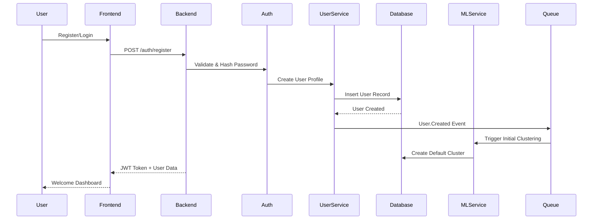
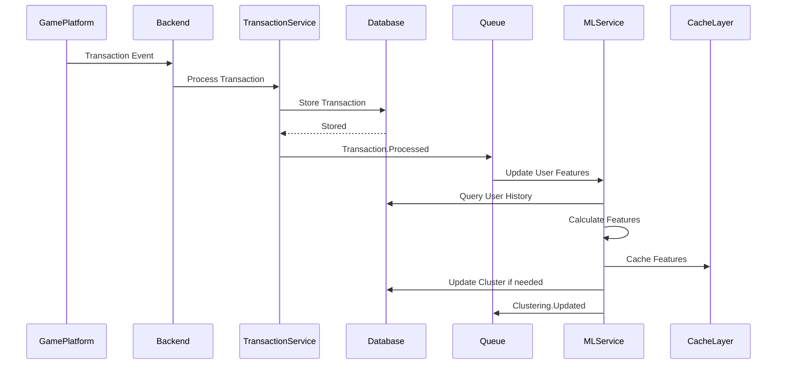
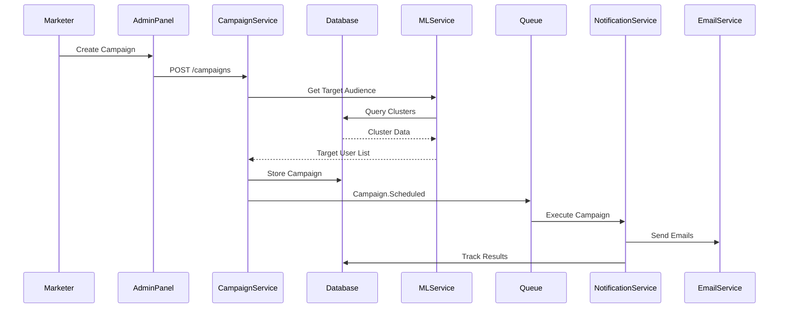

# CRM Inteligente - System Architecture Design

## Overview

The CRM Inteligente is a high-performance, ML-driven customer relationship management system designed specifically for gaming and betting platforms. The system leverages machine learning for intelligent user clustering, behavioral analysis, and personalized campaign targeting.

## System Architecture Diagram

```mermaid
graph TB
    %% External Systems
    SmartICO[SmartICO API]
    PaymentGW[Payment Gateways]
    EmailSrv[Email Service]
    SMSSrv[SMS Service]
    WhatsApp[WhatsApp API]
    
    %% Load Balancer
    LB[Load Balancer<br/>NGINX/Railway]
    
    %% Frontend Layer
    WebApp[React Frontend<br/>Port 3001]
    AdminPanel[Admin Dashboard<br/>React]
    
    %% API Gateway / Backend
    Backend[Node.js Backend API<br/>Port 3000]
    WebSocket[WebSocket Service<br/>Real-time Updates]
    
    %% Authentication & Authorization
    Auth[JWT Authentication<br/>Middleware]
    
    %% Core Services
    UserSrv[User Service]
    TransactionSrv[Transaction Service]
    CampaignSrv[Campaign Service]
    NotificationSrv[Notification Service]
    
    %% ML Pipeline
    MLService[ML Service<br/>Python/Scikit-learn]
    FeatureEng[Feature Engineering]
    ClusteringEngine[Clustering Engine<br/>K-means/DBSCAN]
    ModelServing[Model Serving API]
    
    %% ETL Pipeline
    ETLService[ETL Service<br/>Python]
    DataExtractor[Data Extractors]
    DataTransformer[Data Transformers]
    DataLoader[Data Loaders]
    DataValidator[Data Validators]
    
    %% Storage Layer
    PostgreSQL[(PostgreSQL<br/>Primary Database)]
    Redis[(Redis<br/>Cache & Sessions)]
    RabbitMQ[RabbitMQ<br/>Message Queue]
    S3[AWS S3<br/>Data Lake]
    
    %% Monitoring & Observability
    Monitoring[Monitoring Stack<br/>Prometheus/Grafana]
    Logging[Centralized Logging<br/>ELK Stack]
    HealthCheck[Health Checks]
    
    %% Data Flow Connections
    SmartICO --> ETLService
    PaymentGW --> Backend
    
    LB --> WebApp
    LB --> AdminPanel
    LB --> Backend
    
    WebApp --> Backend
    AdminPanel --> Backend
    Backend --> Auth
    Backend --> WebSocket
    
    Auth --> UserSrv
    Backend --> UserSrv
    Backend --> TransactionSrv
    Backend --> CampaignSrv
    Backend --> NotificationSrv
    
    UserSrv --> PostgreSQL
    TransactionSrv --> PostgreSQL
    CampaignSrv --> PostgreSQL
    NotificationSrv --> RabbitMQ
    
    ETLService --> DataExtractor
    ETLService --> DataTransformer
    ETLService --> DataLoader
    ETLService --> DataValidator
    ETLService --> PostgreSQL
    ETLService --> S3
    
    MLService --> FeatureEng
    MLService --> ClusteringEngine
    MLService --> ModelServing
    MLService --> PostgreSQL
    MLService --> Redis
    
    PostgreSQL --> MLService
    RabbitMQ --> MLService
    RabbitMQ --> NotificationSrv
    
    NotificationSrv --> EmailSrv
    NotificationSrv --> SMSSrv
    NotificationSrv --> WhatsApp
    
    Redis --> Backend
    Redis --> MLService
    
    Backend --> Monitoring
    MLService --> Monitoring
    ETLService --> Monitoring
    
    Backend --> Logging
    MLService --> Logging
    ETLService --> Logging
    
    HealthCheck --> PostgreSQL
    HealthCheck --> Redis
    HealthCheck --> RabbitMQ
```



## Data Flow Architecture

### 1. User Registration & Onboarding Flow



### 2. Transaction Processing & ML Feature Pipeline



### 3. Campaign Targeting & Execution Flow



## Component Architecture

### Backend Services Architecture

#### Core API Service (Node.js)
- **Framework**: Express.js with TypeScript
- **Authentication**: JWT with Redis session management
- **Validation**: Joi schema validation
- **Rate Limiting**: Redis-based rate limiting
- **Caching**: Multi-layer caching strategy
- **Error Handling**: Centralized error handling with detailed logging

#### ML Service (Python)
- **Framework**: FastAPI for high-performance ML serving
- **Clustering**: Scikit-learn with custom pipelines
- **Feature Engineering**: Pandas with optimized aggregations
- **Model Management**: MLflow for experiment tracking
- **Batch Processing**: Celery with Redis broker
- **Real-time Inference**: Redis-cached predictions

#### ETL Service (Python)
- **Data Sources**: SmartICO API, Payment webhooks, User events
- **Processing Engine**: Apache Airflow for workflow orchestration
- **Data Quality**: Great Expectations for validation
- **Storage**: PostgreSQL for structured data, S3 for raw data
- **Monitoring**: Custom metrics and alerting

### Database Architecture

#### PostgreSQL Configuration
```sql
-- High-performance settings for gaming workloads
shared_buffers = '4GB'
effective_cache_size = '12GB'
maintenance_work_mem = '2GB'
checkpoint_completion_target = 0.9
wal_buffers = '64MB'
default_statistics_target = 100
random_page_cost = 1.1
effective_io_concurrency = 200
```

#### Data Partitioning Strategy
- **user_transactions**: Monthly partitioning by timestamp
- **campaign_results**: Quarterly partitioning by created_at
- **user_sessions**: Daily partitioning for recent data retention

#### Replication Setup
- **Master-Slave**: Read replicas for analytics queries
- **Backup Strategy**: Point-in-time recovery with 30-day retention
- **Monitoring**: Connection pooling with PgBouncer

### Cache Architecture (Redis)

#### Cache Layers
1. **L1 - Application Cache**: Short-lived API responses (TTL: 5-15 minutes)
2. **L2 - Session Cache**: User sessions and authentication (TTL: 24 hours) 
3. **L3 - ML Feature Cache**: Pre-computed features (TTL: 1-6 hours)
4. **L4 - Analytics Cache**: Dashboard data (TTL: 30 minutes)

#### Cache Strategies
- **Cache-Aside**: For user profiles and settings
- **Write-Through**: For session data
- **Write-Behind**: For analytics counters
- **Cache Warming**: For ML predictions

### Message Queue Architecture (RabbitMQ)

#### Queue Configuration
```
Exchange: crm.events (topic)
├── user.events
│   ├── user.created
│   ├── user.updated
│   └── user.activity
├── transaction.events
│   ├── transaction.completed
│   ├── transaction.failed
│   └── transaction.suspicious
├── campaign.events
│   ├── campaign.scheduled
│   ├── campaign.executed
│   └── campaign.completed
└── ml.events
    ├── clustering.updated
    ├── features.computed
    └── model.retrained
```

#### Consumer Groups
- **ML Pipeline Consumers**: Process user events for feature updates
- **Campaign Consumers**: Handle campaign execution and delivery
- **Analytics Consumers**: Process events for real-time dashboards
- **Notification Consumers**: Handle multi-channel notifications

## Security Architecture

### Authentication & Authorization

#### JWT Implementation
```typescript
interface JWTPayload {
  userId: string;
  email: string;
  roles: string[];
  permissions: string[];
  sessionId: string;
  iat: number;
  exp: number;
}
```

#### Role-Based Access Control (RBAC)
- **SuperAdmin**: Full system access
- **Admin**: User management, campaign creation
- **Analyst**: Read-only analytics access
- **Support**: Limited user support functions
- **API**: Service-to-service authentication

### Data Protection

#### Encryption Standards
- **At Rest**: AES-256 encryption for sensitive data
- **In Transit**: TLS 1.3 for all communications
- **Database**: Transparent Data Encryption (TDE)
- **Backups**: Encrypted backup storage

#### PII Protection
- **Email**: Hashed for lookups, encrypted for storage
- **Phone**: Format validation and encryption
- **Financial Data**: PCI DSS compliance measures
- **IP Addresses**: Anonymization after 90 days

### API Security

#### Rate Limiting
```typescript
const rateLimits = {
  authentication: { windowMs: 15 * 60 * 1000, max: 5 },
  api: { windowMs: 15 * 60 * 1000, max: 1000 },
  ml: { windowMs: 60 * 1000, max: 100 },
  webhooks: { windowMs: 60 * 1000, max: 10000 }
};
```

#### Input Validation
- **Schema Validation**: Joi for request validation
- **SQL Injection Prevention**: Parameterized queries only
- **XSS Protection**: Output encoding and CSP headers
- **CSRF Protection**: Double-submit cookie pattern

## Performance Architecture

### Scalability Strategy

#### Horizontal Scaling
- **API Service**: Load-balanced containers with session affinity
- **ML Service**: Worker pool with queue-based task distribution
- **Database**: Read replicas with connection pooling
- **Cache**: Redis Cluster with consistent hashing

#### Vertical Scaling
- **CPU-Intensive**: ML training and feature computation
- **Memory-Intensive**: Large dataset processing and caching
- **I/O-Intensive**: Database operations and file processing

### Performance Monitoring

#### Key Metrics
```typescript
interface PerformanceMetrics {
  apiResponse: {
    p50: number; // 50th percentile response time
    p95: number; // 95th percentile response time
    p99: number; // 99th percentile response time
    errorRate: number; // Error rate percentage
    throughput: number; // Requests per second
  };
  database: {
    connectionPool: number; // Active connections
    queryTime: number; // Average query time
    lockWaits: number; // Lock wait events
    cacheHitRatio: number; // Cache hit percentage
  };
  ml: {
    predictionLatency: number; // ML prediction time
    modelAccuracy: number; // Model performance
    featureProcessingTime: number; // Feature computation time
  };
}
```

#### SLA Targets
- **API Response Time**: < 200ms (95th percentile)
- **ML Predictions**: < 100ms (99th percentile)
- **Database Queries**: < 50ms (95th percentile)
- **System Availability**: 99.9% uptime
- **Data Consistency**: 99.99% accuracy

## Disaster Recovery & Business Continuity

### Backup Strategy
- **Full Backups**: Daily full database backups
- **Incremental Backups**: Hourly transaction log backups
- **Application Backups**: Daily container image backups
- **Configuration Backups**: Version-controlled infrastructure

### Recovery Procedures
- **RTO (Recovery Time Objective)**: < 4 hours
- **RPO (Recovery Point Objective)**: < 1 hour
- **Failover Strategy**: Automated failover with health checks
- **Data Recovery**: Point-in-time recovery capabilities

### High Availability
- **Database**: Master-slave replication with automatic failover
- **Application**: Multi-region deployment with load balancing
- **Cache**: Redis Sentinel for automatic failover
- **Message Queue**: RabbitMQ clustering with mirrored queues

## Technology Stack Summary

### Frontend
- **Framework**: React 18 with TypeScript
- **State Management**: Redux Toolkit with RTK Query
- **UI Library**: Material-UI v5
- **Build Tool**: Vite for fast development builds
- **Testing**: Jest + React Testing Library

### Backend
- **Runtime**: Node.js 18 LTS
- **Framework**: Express.js with TypeScript
- **ORM**: Prisma for type-safe database access
- **Validation**: Joi for schema validation
- **Testing**: Jest + Supertest for API testing

### Machine Learning
- **Language**: Python 3.11
- **ML Framework**: Scikit-learn + XGBoost
- **Data Processing**: Pandas + NumPy
- **API Framework**: FastAPI for ML serving
- **Experiment Tracking**: MLflow

### Infrastructure
- **Containerization**: Docker with multi-stage builds
- **Orchestration**: Docker Compose for development
- **Database**: PostgreSQL 15 with performance tuning
- **Cache**: Redis 7 with clustering support
- **Message Queue**: RabbitMQ 3.12 with management plugin

### DevOps & Monitoring
- **Deployment**: Railway for cloud deployment
- **Monitoring**: Prometheus + Grafana
- **Logging**: Winston + ELK Stack
- **CI/CD**: GitHub Actions
- **Security Scanning**: Snyk for vulnerability detection

This architecture provides a robust, scalable foundation for the CRM Inteligente system, optimized for high-performance gaming and betting workloads with advanced ML capabilities.