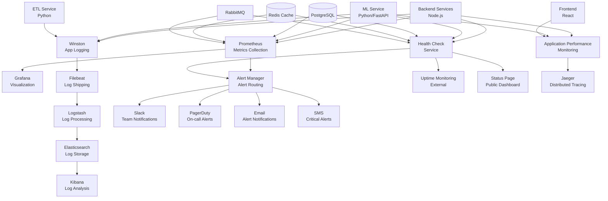

# CRM Inteligente - Monitoring, Logging & Health Check Systems

## Overview

This document outlines the comprehensive monitoring, logging, and health check architecture for CRM Inteligente. The system provides real-time observability, proactive alerting, centralized logging, and automated health monitoring to ensure high availability and performance.

## Monitoring Architecture Diagram



## Metrics Collection & Monitoring

### Prometheus Configuration

#### Prometheus Server Configuration
```yaml
# prometheus.yml
global:
  scrape_interval: 15s
  evaluation_interval: 15s
  external_labels:
    cluster: 'crmbet-production'
    environment: 'production'

rule_files:
  - "alert_rules.yml"
  - "recording_rules.yml"

alerting:
  alertmanagers:
    - static_configs:
        - targets:
          - alertmanager:9093

scrape_configs:
  # Backend API metrics
  - job_name: 'crmbet-backend'
    static_configs:
      - targets: ['backend:3000']
    metrics_path: '/metrics'
    scrape_interval: 10s
    scrape_timeout: 5s
    
  # ML Service metrics
  - job_name: 'crmbet-ml'
    static_configs:
      - targets: ['ml-service:8000']
    metrics_path: '/metrics'
    scrape_interval: 15s
    
  # Database metrics
  - job_name: 'postgres'
    static_configs:
      - targets: ['postgres-exporter:9187']
    
  # Redis metrics
  - job_name: 'redis'
    static_configs:
      - targets: ['redis-exporter:9121']
    
  # RabbitMQ metrics
  - job_name: 'rabbitmq'
    static_configs:
      - targets: ['rabbitmq:15692']
    
  # Node exporter for system metrics
  - job_name: 'node'
    static_configs:
      - targets: ['node-exporter:9100']
    
  # Cadvisor for container metrics
  - job_name: 'cadvisor'
    static_configs:
      - targets: ['cadvisor:8080']
```

#### Custom Metrics Implementation
```typescript
// metrics.ts
import client from 'prom-client';

class MetricsCollector {
  private registry: client.Registry;
  
  // HTTP Request metrics
  private httpRequestDuration = new client.Histogram({
    name: 'http_request_duration_seconds',
    help: 'Duration of HTTP requests in seconds',
    labelNames: ['method', 'route', 'status_code'],
    buckets: [0.005, 0.01, 0.025, 0.05, 0.1, 0.25, 0.5, 1, 2.5, 5, 10]
  });
  
  private httpRequestsTotal = new client.Counter({
    name: 'http_requests_total',
    help: 'Total number of HTTP requests',
    labelNames: ['method', 'route', 'status_code']
  });
  
  // Database metrics
  private dbConnectionsActive = new client.Gauge({
    name: 'db_connections_active',
    help: 'Number of active database connections'
  });
  
  private dbQueryDuration = new client.Histogram({
    name: 'db_query_duration_seconds',
    help: 'Database query execution time',
    labelNames: ['query_type', 'table'],
    buckets: [0.001, 0.005, 0.01, 0.025, 0.05, 0.1, 0.25, 0.5, 1, 2]
  });
  
  // Cache metrics
  private cacheHits = new client.Counter({
    name: 'cache_hits_total',
    help: 'Total number of cache hits',
    labelNames: ['cache_layer', 'key_type']
  });
  
  private cacheMisses = new client.Counter({
    name: 'cache_misses_total',
    help: 'Total number of cache misses',
    labelNames: ['cache_layer', 'key_type']
  });
  
  // Business metrics
  private userRegistrations = new client.Counter({
    name: 'user_registrations_total',
    help: 'Total number of user registrations',
    labelNames: ['country', 'source']
  });
  
  private transactionsTotal = new client.Counter({
    name: 'transactions_total',
    help: 'Total number of transactions',
    labelNames: ['type', 'status']
  });
  
  private transactionAmount = new client.Histogram({
    name: 'transaction_amount',
    help: 'Transaction amounts',
    labelNames: ['type', 'currency'],
    buckets: [1, 10, 50, 100, 500, 1000, 5000, 10000, 50000]
  });
  
  // ML metrics
  private mlPredictions = new client.Counter({
    name: 'ml_predictions_total',
    help: 'Total number of ML predictions',
    labelNames: ['model_type', 'prediction_type']
  });
  
  private mlPredictionLatency = new client.Histogram({
    name: 'ml_prediction_latency_seconds',
    help: 'ML prediction latency',
    labelNames: ['model_type'],
    buckets: [0.01, 0.025, 0.05, 0.1, 0.25, 0.5, 1, 2]
  });
  
  private mlModelAccuracy = new client.Gauge({
    name: 'ml_model_accuracy',
    help: 'ML model accuracy score',
    labelNames: ['model_type', 'model_version']
  });
  
  constructor() {
    this.registry = new client.Registry();
    
    // Register all metrics
    this.registry.registerMetric(this.httpRequestDuration);
    this.registry.registerMetric(this.httpRequestsTotal);
    this.registry.registerMetric(this.dbConnectionsActive);
    this.registry.registerMetric(this.dbQueryDuration);
    this.registry.registerMetric(this.cacheHits);
    this.registry.registerMetric(this.cacheMisses);
    this.registry.registerMetric(this.userRegistrations);
    this.registry.registerMetric(this.transactionsTotal);
    this.registry.registerMetric(this.transactionAmount);
    this.registry.registerMetric(this.mlPredictions);
    this.registry.registerMetric(this.mlPredictionLatency);
    this.registry.registerMetric(this.mlModelAccuracy);
    
    // Collect default metrics
    client.collectDefaultMetrics({ register: this.registry });
  }
  
  // Middleware for HTTP metrics
  httpMetricsMiddleware() {
    return (req: Request, res: Response, next: NextFunction) => {
      const start = Date.now();
      
      res.on('finish', () => {
        const duration = (Date.now() - start) / 1000;
        const route = req.route?.path || req.path;
        
        this.httpRequestDuration
          .labels(req.method, route, res.statusCode.toString())
          .observe(duration);
          
        this.httpRequestsTotal
          .labels(req.method, route, res.statusCode.toString())
          .inc();
      });
      
      next();
    };
  }
  
  // Track database metrics
  trackDBConnection(activeConnections: number): void {
    this.dbConnectionsActive.set(activeConnections);
  }
  
  trackDBQuery(queryType: string, table: string, duration: number): void {
    this.dbQueryDuration.labels(queryType, table).observe(duration);
  }
  
  // Track cache metrics
  trackCacheHit(layer: string, keyType: string): void {
    this.cacheHits.labels(layer, keyType).inc();
  }
  
  trackCacheMiss(layer: string, keyType: string): void {
    this.cacheMisses.labels(layer, keyType).inc();
  }
  
  // Track business metrics
  trackUserRegistration(country: string, source: string): void {
    this.userRegistrations.labels(country, source).inc();
  }
  
  trackTransaction(type: string, status: string, amount: number, currency: string): void {
    this.transactionsTotal.labels(type, status).inc();
    this.transactionAmount.labels(type, currency).observe(amount);
  }
  
  // Track ML metrics
  trackMLPrediction(modelType: string, predictionType: string, latency: number): void {
    this.mlPredictions.labels(modelType, predictionType).inc();
    this.mlPredictionLatency.labels(modelType).observe(latency);
  }
  
  updateMLModelAccuracy(modelType: string, version: string, accuracy: number): void {
    this.mlModelAccuracy.labels(modelType, version).set(accuracy);
  }
  
  // Get metrics endpoint
  async getMetrics(): Promise<string> {
    return this.registry.metrics();
  }
}

export const metricsCollector = new MetricsCollector();
```

### Grafana Dashboard Configuration

#### Main Dashboard JSON
```json
{
  "dashboard": {
    "id": null,
    "title": "CRM Inteligente - System Overview",
    "tags": ["crmbet", "overview"],
    "timezone": "America/Sao_Paulo",
    "panels": [
      {
        "id": 1,
        "title": "API Response Time (P95)",
        "type": "stat",
        "targets": [
          {
            "expr": "histogram_quantile(0.95, rate(http_request_duration_seconds_bucket[5m]))",
            "legendFormat": "P95 Response Time"
          }
        ],
        "fieldConfig": {
          "defaults": {
            "unit": "s",
            "thresholds": {
              "steps": [
                {"color": "green", "value": null},
                {"color": "yellow", "value": 0.5},
                {"color": "red", "value": 1.0}
              ]
            }
          }
        }
      },
      {
        "id": 2,
        "title": "Requests per Second",
        "type": "graph",
        "targets": [
          {
            "expr": "rate(http_requests_total[1m])",
            "legendFormat": "{{method}} {{route}}"
          }
        ]
      },
      {
        "id": 3,
        "title": "Database Connections",
        "type": "graph",
        "targets": [
          {
            "expr": "db_connections_active",
            "legendFormat": "Active Connections"
          }
        ]
      },
      {
        "id": 4,
        "title": "Cache Hit Ratio",
        "type": "stat",
        "targets": [
          {
            "expr": "rate(cache_hits_total[5m]) / (rate(cache_hits_total[5m]) + rate(cache_misses_total[5m]))",
            "legendFormat": "Cache Hit Ratio"
          }
        ],
        "fieldConfig": {
          "defaults": {
            "unit": "percentunit",
            "min": 0,
            "max": 1
          }
        }
      },
      {
        "id": 5,
        "title": "Transactions per Minute",
        "type": "graph",
        "targets": [
          {
            "expr": "rate(transactions_total[1m]) * 60",
            "legendFormat": "{{type}}"
          }
        ]
      },
      {
        "id": 6,
        "title": "ML Prediction Latency",
        "type": "graph",
        "targets": [
          {
            "expr": "histogram_quantile(0.95, rate(ml_prediction_latency_seconds_bucket[5m]))",
            "legendFormat": "{{model_type}} P95"
          }
        ]
      }
    ],
    "time": {
      "from": "now-1h",
      "to": "now"
    },
    "refresh": "10s"
  }
}
```

## Alert Rules & Notification

### Prometheus Alert Rules
```yaml
# alert_rules.yml
groups:
  - name: crmbet.rules
    rules:
      # High error rate
      - alert: HighErrorRate
        expr: rate(http_requests_total{status_code=~"5.."}[5m]) > 0.1
        for: 2m
        labels:
          severity: critical
          service: api
        annotations:
          summary: "High error rate detected"
          description: "Error rate is {{ $value }} errors per second for {{ $labels.route }}"
      
      # High response time
      - alert: HighResponseTime
        expr: histogram_quantile(0.95, rate(http_request_duration_seconds_bucket[5m])) > 1
        for: 5m
        labels:
          severity: warning
          service: api
        annotations:
          summary: "High response time detected"
          description: "95th percentile response time is {{ $value }}s"
      
      # Database connection pool exhaustion
      - alert: DBConnectionPoolHigh
        expr: db_connections_active / db_connections_max > 0.8
        for: 5m
        labels:
          severity: warning
          service: database
        annotations:
          summary: "Database connection pool usage high"
          description: "Connection pool usage is {{ $value | humanizePercentage }}"
      
      # Low cache hit ratio
      - alert: LowCacheHitRatio
        expr: rate(cache_hits_total[10m]) / (rate(cache_hits_total[10m]) + rate(cache_misses_total[10m])) < 0.7
        for: 10m
        labels:
          severity: warning
          service: cache
        annotations:
          summary: "Low cache hit ratio"
          description: "Cache hit ratio is {{ $value | humanizePercentage }} for {{ $labels.cache_layer }}"
      
      # ML model accuracy degradation
      - alert: MLModelAccuracyLow
        expr: ml_model_accuracy < 0.8
        for: 15m
        labels:
          severity: warning
          service: ml
        annotations:
          summary: "ML model accuracy below threshold"
          description: "Model {{ $labels.model_type }} accuracy is {{ $value | humanizePercentage }}"
      
      # High memory usage
      - alert: HighMemoryUsage
        expr: (node_memory_MemTotal_bytes - node_memory_MemAvailable_bytes) / node_memory_MemTotal_bytes > 0.9
        for: 5m
        labels:
          severity: critical
          service: system
        annotations:
          summary: "High memory usage"
          description: "Memory usage is {{ $value | humanizePercentage }}"
      
      # High CPU usage
      - alert: HighCPUUsage
        expr: 100 - (avg by(instance) (irate(node_cpu_seconds_total{mode="idle"}[5m])) * 100) > 80
        for: 5m
        labels:
          severity: warning
          service: system
        annotations:
          summary: "High CPU usage"
          description: "CPU usage is {{ $value | humanizePercentage }}"
      
      # Disk space low
      - alert: DiskSpaceLow
        expr: (node_filesystem_avail_bytes{mountpoint="/"} / node_filesystem_size_bytes{mountpoint="/"}) < 0.1
        for: 5m
        labels:
          severity: critical
          service: system
        annotations:
          summary: "Low disk space"
          description: "Disk space usage is {{ $value | humanizePercentage }}"
```

### AlertManager Configuration
```yaml
# alertmanager.yml
global:
  smtp_smarthost: 'smtp.gmail.com:587'
  smtp_from: 'alerts@crmbet.com'
  slack_api_url: 'https://hooks.slack.com/services/YOUR/SLACK/WEBHOOK'

route:
  group_by: ['alertname', 'service']
  group_wait: 10s
  group_interval: 10s
  repeat_interval: 1h
  receiver: 'web.hook'
  routes:
    - match:
        severity: critical
      receiver: 'critical-alerts'
    - match:
        service: database
      receiver: 'database-team'
    - match:
        service: ml
      receiver: 'ml-team'

receivers:
  - name: 'web.hook'
    slack_configs:
      - channel: '#alerts'
        title: 'CRM Alert'
        text: '{{ range .Alerts }}{{ .Annotations.summary }}{{ end }}'
        
  - name: 'critical-alerts'
    slack_configs:
      - channel: '#critical-alerts'
        title: 'CRITICAL: CRM Alert'
        text: '{{ range .Alerts }}{{ .Annotations.summary }}\n{{ .Annotations.description }}{{ end }}'
    pagerduty_configs:
      - service_key: 'YOUR_PAGERDUTY_SERVICE_KEY'
    email_configs:
      - to: 'oncall@crmbet.com'
        subject: 'CRITICAL: CRM Alert'
        body: '{{ range .Alerts }}{{ .Annotations.summary }}\n{{ .Annotations.description }}{{ end }}'
        
  - name: 'database-team'
    email_configs:
      - to: 'dba@crmbet.com'
        subject: 'Database Alert'
        body: '{{ range .Alerts }}{{ .Annotations.summary }}\n{{ .Annotations.description }}{{ end }}'
        
  - name: 'ml-team'
    email_configs:
      - to: 'ml-team@crmbet.com'
        subject: 'ML Service Alert'
        body: '{{ range .Alerts }}{{ .Annotations.summary }}\n{{ .Annotations.description }}{{ end }}'

inhibit_rules:
  - source_match:
      severity: 'critical'
    target_match:
      severity: 'warning'
    equal: ['alertname', 'service']
```

## Centralized Logging

### Application Logging Configuration

#### Winston Logger Setup
```typescript
// logger.ts
import winston from 'winston';
import 'winston-daily-rotate-file';

class Logger {
  private logger: winston.Logger;
  
  constructor() {
    this.logger = winston.createLogger({
      level: process.env.LOG_LEVEL || 'info',
      format: winston.format.combine(
        winston.format.timestamp(),
        winston.format.errors({ stack: true }),
        winston.format.json(),
        this.addMetadata()
      ),
      defaultMeta: {
        service: 'crmbet-backend',
        version: process.env.APP_VERSION || '1.0.0',
        environment: process.env.NODE_ENV || 'development'
      },
      transports: [
        // Console output for development
        new winston.transports.Console({
          format: winston.format.combine(
            winston.format.colorize(),
            winston.format.simple()
          )
        }),
        
        // File output with rotation
        new winston.transports.DailyRotateFile({
          filename: 'logs/application-%DATE%.log',
          datePattern: 'YYYY-MM-DD',
          maxSize: '100m',
          maxFiles: '30d',
          level: 'info'
        }),
        
        // Error file with rotation
        new winston.transports.DailyRotateFile({
          filename: 'logs/error-%DATE%.log',
          datePattern: 'YYYY-MM-DD',
          maxSize: '100m',
          maxFiles: '30d',
          level: 'error'
        }),
        
        // Elasticsearch transport for centralized logging
        new winston.transports.Http({
          host: process.env.ELASTICSEARCH_HOST || 'localhost',
          port: parseInt(process.env.ELASTICSEARCH_PORT || '9200'),
          path: '/logs/_doc',
          level: 'info'
        })
      ],
      
      // Handle exceptions and rejections
      exceptionHandlers: [
        new winston.transports.File({ filename: 'logs/exceptions.log' })
      ],
      rejectionHandlers: [
        new winston.transports.File({ filename: 'logs/rejections.log' })
      ]
    });
  }
  
  private addMetadata() {
    return winston.format((info) => {
      info.hostname = require('os').hostname();
      info.pid = process.pid;
      info.correlationId = this.getCorrelationId();
      return info;
    })();
  }
  
  private getCorrelationId(): string {
    // Get correlation ID from request context
    return require('cls-hooked').getNamespace('request')?.get('correlationId') || '';
  }
  
  // Structured logging methods
  info(message: string, meta?: any): void {
    this.logger.info(message, meta);
  }
  
  error(message: string, error?: Error, meta?: any): void {
    this.logger.error(message, { error: error?.stack, ...meta });
  }
  
  warn(message: string, meta?: any): void {
    this.logger.warn(message, meta);
  }
  
  debug(message: string, meta?: any): void {
    this.logger.debug(message, meta);
  }
  
  // Business event logging
  logUserAction(userId: string, action: string, details?: any): void {
    this.logger.info('User action', {
      userId,
      action,
      details,
      category: 'user_action'
    });
  }
  
  logTransaction(transactionId: string, userId: string, type: string, amount: number): void {
    this.logger.info('Transaction processed', {
      transactionId,
      userId,
      type,
      amount,
      category: 'transaction'
    });
  }
  
  logMLPrediction(userId: string, modelType: string, prediction: any, confidence: number): void {
    this.logger.info('ML prediction generated', {
      userId,
      modelType,
      prediction,
      confidence,
      category: 'ml_prediction'
    });
  }
  
  logSecurityEvent(eventType: string, userId?: string, details?: any): void {
    this.logger.warn('Security event', {
      eventType,
      userId,
      details,
      category: 'security'
    });
  }
  
  logAPICall(method: string, endpoint: string, responseTime: number, statusCode: number, userId?: string): void {
    this.logger.info('API call', {
      method,
      endpoint,
      responseTime,
      statusCode,
      userId,
      category: 'api_call'
    });
  }
}

export const logger = new Logger();
```

### ELK Stack Configuration

#### Logstash Configuration
```yaml
# logstash.conf
input {
  beats {
    port => 5044
  }
  
  http {
    port => 8080
    codec => json
  }
}

filter {
  # Parse application logs
  if [fields][service] == "crmbet-backend" {
    json {
      source => "message"
    }
    
    date {
      match => [ "timestamp", "ISO8601" ]
    }
    
    # Extract user ID for user-specific queries
    if [userId] {
      mutate {
        add_field => { "user_context" => "%{userId}" }
      }
    }
    
    # Add geographic context if IP is available
    if [ip] {
      geoip {
        source => "ip"
        target => "geoip"
      }
    }
    
    # Classify log level importance
    if [level] == "error" {
      mutate {
        add_field => { "priority" => "high" }
      }
    } else if [level] == "warn" {
      mutate {
        add_field => { "priority" => "medium" }
      }
    } else {
      mutate {
        add_field => { "priority" => "low" }
      }
    }
  }
  
  # Parse ML service logs
  if [fields][service] == "crmbet-ml" {
    json {
      source => "message"
    }
    
    # Extract model performance metrics
    if [category] == "ml_prediction" {
      mutate {
        convert => { "confidence" => "float" }
        add_field => { "metric_type" => "ml_performance" }
      }
    }
  }
  
  # Parse database logs
  if [fields][service] == "postgresql" {
    grok {
      match => { 
        "message" => "%{TIMESTAMP_ISO8601:timestamp} \[%{NUMBER:pid}\] %{WORD:user}@%{WORD:database} %{WORD:level}: %{GREEDYDATA:query_message}"
      }
    }
    
    # Extract slow queries
    if [query_message] =~ /duration: \d+\.\d+ ms/ {
      grok {
        match => { 
          "query_message" => "duration: %{NUMBER:duration:float} ms"
        }
      }
      
      if [duration] and [duration] > 1000 {
        mutate {
          add_field => { "slow_query" => "true" }
          add_field => { "priority" => "medium" }
        }
      }
    }
  }
}

output {
  elasticsearch {
    hosts => ["elasticsearch:9200"]
    index => "crmbet-logs-%{+YYYY.MM.dd}"
    template_name => "crmbet-logs"
    template => "/etc/logstash/templates/crmbet-logs.json"
  }
  
  # Output high priority logs to separate index
  if [priority] == "high" {
    elasticsearch {
      hosts => ["elasticsearch:9200"]
      index => "crmbet-alerts-%{+YYYY.MM.dd}"
    }
  }
  
  # Debug output
  if [level] == "debug" {
    stdout { codec => rubydebug }
  }
}
```

#### Elasticsearch Index Template
```json
{
  "index_patterns": ["crmbet-logs-*"],
  "settings": {
    "number_of_shards": 3,
    "number_of_replicas": 1,
    "index": {
      "refresh_interval": "5s",
      "max_result_window": 50000
    }
  },
  "mappings": {
    "properties": {
      "@timestamp": { "type": "date" },
      "timestamp": { "type": "date" },
      "level": { "type": "keyword" },
      "message": { "type": "text" },
      "service": { "type": "keyword" },
      "environment": { "type": "keyword" },
      "version": { "type": "keyword" },
      "userId": { "type": "keyword" },
      "correlationId": { "type": "keyword" },
      "category": { "type": "keyword" },
      "priority": { "type": "keyword" },
      "hostname": { "type": "keyword" },
      "pid": { "type": "integer" },
      "error": { "type": "text" },
      "duration": { "type": "float" },
      "responseTime": { "type": "float" },
      "statusCode": { "type": "integer" },
      "method": { "type": "keyword" },
      "endpoint": { "type": "keyword" },
      "geoip": {
        "properties": {
          "country_name": { "type": "keyword" },
          "city_name": { "type": "keyword" },
          "location": { "type": "geo_point" }
        }
      }
    }
  }
}
```

## Health Check Systems

### Comprehensive Health Check Service
```typescript
// health-check.ts
import { performance } from 'perf_hooks';

interface HealthCheckResult {
  status: 'healthy' | 'unhealthy' | 'degraded';
  timestamp: string;
  checks: Record<string, ComponentHealth>;
  duration: number;
}

interface ComponentHealth {
  status: 'healthy' | 'unhealthy' | 'degraded';
  responseTime: number;
  details?: any;
  error?: string;
}

class HealthCheckService {
  private checks = new Map<string, HealthCheckFunction>();
  private cache = new Map<string, { result: ComponentHealth; timestamp: number }>();
  private cacheTimeout = 30000; // 30 seconds
  
  constructor() {
    this.registerDefaultChecks();
  }
  
  private registerDefaultChecks(): void {
    this.checks.set('database', this.checkDatabase.bind(this));
    this.checks.set('redis', this.checkRedis.bind(this));
    this.checks.set('rabbitmq', this.checkRabbitMQ.bind(this));
    this.checks.set('ml_service', this.checkMLService.bind(this));
    this.checks.set('external_apis', this.checkExternalAPIs.bind(this));
    this.checks.set('disk_space', this.checkDiskSpace.bind(this));
    this.checks.set('memory', this.checkMemory.bind(this));
  }
  
  async performHealthCheck(): Promise<HealthCheckResult> {
    const startTime = performance.now();
    const checks: Record<string, ComponentHealth> = {};
    
    // Run all health checks in parallel
    const checkPromises = Array.from(this.checks.entries()).map(
      async ([name, checkFn]) => {
        try {
          const result = await this.runCachedCheck(name, checkFn);
          checks[name] = result;
        } catch (error) {
          checks[name] = {
            status: 'unhealthy',
            responseTime: 0,
            error: error.message
          };
        }
      }
    );
    
    await Promise.all(checkPromises);
    
    const duration = performance.now() - startTime;
    const overallStatus = this.calculateOverallStatus(checks);
    
    return {
      status: overallStatus,
      timestamp: new Date().toISOString(),
      checks,
      duration
    };
  }
  
  private async runCachedCheck(name: string, checkFn: HealthCheckFunction): Promise<ComponentHealth> {
    const cached = this.cache.get(name);
    
    if (cached && Date.now() - cached.timestamp < this.cacheTimeout) {
      return cached.result;
    }
    
    const startTime = performance.now();
    const result = await checkFn();
    const responseTime = performance.now() - startTime;
    
    const componentHealth: ComponentHealth = {
      ...result,
      responseTime
    };
    
    this.cache.set(name, {
      result: componentHealth,
      timestamp: Date.now()
    });
    
    return componentHealth;
  }
  
  private async checkDatabase(): Promise<Partial<ComponentHealth>> {
    try {
      const result = await db.query('SELECT 1 as health_check');
      const connectionCount = await db.query('SELECT count(*) FROM pg_stat_activity');
      
      return {
        status: 'healthy',
        details: {
          connected: true,
          active_connections: connectionCount.rows[0].count
        }
      };
    } catch (error) {
      return {
        status: 'unhealthy',
        error: error.message
      };
    }
  }
  
  private async checkRedis(): Promise<Partial<ComponentHealth>> {
    try {
      await redis.ping();
      const info = await redis.info('memory');
      const memoryUsage = this.parseRedisInfo(info);
      
      return {
        status: 'healthy',
        details: {
          connected: true,
          memory_usage: memoryUsage
        }
      };
    } catch (error) {
      return {
        status: 'unhealthy',
        error: error.message
      };
    }
  }
  
  private async checkRabbitMQ(): Promise<Partial<ComponentHealth>> {
    try {
      const connection = await amqp.connect(process.env.RABBITMQ_URL);
      const channel = await connection.createChannel();
      
      // Check queue status
      const queueInfo = await channel.checkQueue('user.events');
      
      await channel.close();
      await connection.close();
      
      return {
        status: 'healthy',
        details: {
          connected: true,
          queue_message_count: queueInfo.messageCount
        }
      };
    } catch (error) {
      return {
        status: 'unhealthy',
        error: error.message
      };
    }
  }
  
  private async checkMLService(): Promise<Partial<ComponentHealth>> {
    try {
      const response = await fetch(`${process.env.ML_SERVICE_URL}/health`, {
        timeout: 5000
      });
      
      if (response.ok) {
        const healthData = await response.json();
        return {
          status: 'healthy',
          details: healthData
        };
      } else {
        return {
          status: 'unhealthy',
          error: `ML service returned ${response.status}`
        };
      }
    } catch (error) {
      return {
        status: 'unhealthy',
        error: error.message
      };
    }
  }
  
  private async checkExternalAPIs(): Promise<Partial<ComponentHealth>> {
    const apis = [
      { name: 'SmartICO', url: process.env.SMARTICO_API_URL },
      { name: 'Payment Gateway', url: process.env.PAYMENT_API_URL }
    ];
    
    const apiResults = await Promise.allSettled(
      apis.map(async (api) => {
        const response = await fetch(`${api.url}/health`, { timeout: 3000 });
        return { name: api.name, status: response.ok };
      })
    );
    
    const failedAPIs = apiResults
      .filter((result, index) => 
        result.status === 'rejected' || !result.value.status
      )
      .map((_, index) => apis[index].name);
    
    if (failedAPIs.length === 0) {
      return {
        status: 'healthy',
        details: { all_apis_healthy: true }
      };
    } else if (failedAPIs.length < apis.length) {
      return {
        status: 'degraded',
        details: { failed_apis: failedAPIs }
      };
    } else {
      return {
        status: 'unhealthy',
        error: 'All external APIs are unreachable'
      };
    }
  }
  
  private async checkDiskSpace(): Promise<Partial<ComponentHealth>> {
    const fs = require('fs').promises;
    const stats = await fs.statSync('/');
    
    const total = stats.size;
    const free = stats.free;
    const usedPercentage = ((total - free) / total) * 100;
    
    let status: 'healthy' | 'degraded' | 'unhealthy' = 'healthy';
    if (usedPercentage > 90) {
      status = 'unhealthy';
    } else if (usedPercentage > 80) {
      status = 'degraded';
    }
    
    return {
      status,
      details: {
        total_bytes: total,
        free_bytes: free,
        used_percentage: usedPercentage
      }
    };
  }
  
  private async checkMemory(): Promise<Partial<ComponentHealth>> {
    const memUsage = process.memoryUsage();
    const totalMem = require('os').totalmem();
    const freeMem = require('os').freemem();
    
    const usedPercentage = ((totalMem - freeMem) / totalMem) * 100;
    
    let status: 'healthy' | 'degraded' | 'unhealthy' = 'healthy';
    if (usedPercentage > 95) {
      status = 'unhealthy';
    } else if (usedPercentage > 85) {
      status = 'degraded';
    }
    
    return {
      status,
      details: {
        heap_used: memUsage.heapUsed,
        heap_total: memUsage.heapTotal,
        system_memory_used_percentage: usedPercentage
      }
    };
  }
  
  private calculateOverallStatus(checks: Record<string, ComponentHealth>): 'healthy' | 'unhealthy' | 'degraded' {
    const statuses = Object.values(checks).map(check => check.status);
    
    if (statuses.includes('unhealthy')) {
      return 'unhealthy';
    } else if (statuses.includes('degraded')) {
      return 'degraded';
    } else {
      return 'healthy';
    }
  }
}

export const healthCheckService = new HealthCheckService();
```

### Health Check Endpoints
```typescript
// health-routes.ts
import { Router } from 'express';
import { healthCheckService } from './health-check';

const router = Router();

// Lightweight health check for load balancer
router.get('/health', async (req, res) => {
  res.status(200).json({ status: 'ok', timestamp: new Date().toISOString() });
});

// Comprehensive health check
router.get('/health/detailed', async (req, res) => {
  try {
    const healthResult = await healthCheckService.performHealthCheck();
    
    const statusCode = healthResult.status === 'healthy' ? 200 : 
                      healthResult.status === 'degraded' ? 200 : 503;
    
    res.status(statusCode).json(healthResult);
  } catch (error) {
    res.status(503).json({
      status: 'unhealthy',
      timestamp: new Date().toISOString(),
      error: error.message
    });
  }
});

// Readiness probe (Kubernetes)
router.get('/ready', async (req, res) => {
  try {
    // Check critical dependencies only
    const criticalChecks = await healthCheckService.performCriticalChecks(['database', 'redis']);
    
    if (criticalChecks.status === 'healthy') {
      res.status(200).json({ status: 'ready' });
    } else {
      res.status(503).json({ status: 'not ready', checks: criticalChecks });
    }
  } catch (error) {
    res.status(503).json({ status: 'not ready', error: error.message });
  }
});

// Liveness probe (Kubernetes)
router.get('/live', async (req, res) => {
  // Simple liveness check - is the application responding?
  res.status(200).json({ status: 'alive', pid: process.pid });
});

export default router;
```

This comprehensive monitoring, logging, and health check system provides complete observability for CRM Inteligente, enabling proactive issue detection, rapid troubleshooting, and maintaining high availability across all system components.