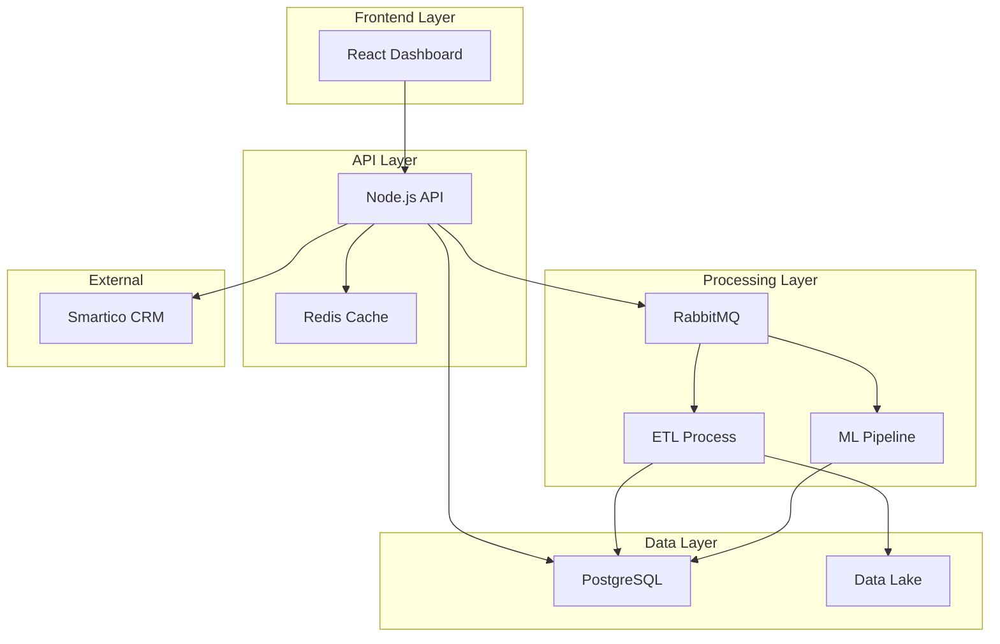

# 🏗️ System Patterns - Arquitetura Técnica

## 📐 Arquitetura Geral

### Padrão Principal: Microserviços


## 🔄 Fluxo de Dados Principal

### Fluxo 1: Ingestão de Dados
```
Data Lake → ETL Process → Data Validation → PostgreSQL
```

### Fluxo 2: Clusterização ML
```
PostgreSQL → ML Pipeline → Feature Engineering → Clustering → Results → PostgreSQL
```

### Fluxo 3: API de Consulta
```
Client Request → API → Redis Check → PostgreSQL Query → Response
```

### Fluxo 4: Campanha Automática
```
Trigger → API → Cluster Analysis → Smartico API → Campaign Creation
```

## 🎯 Padrões de Design Aplicados

### 1. Repository Pattern
- **Localização**: Backend API
- **Propósito**: Abstração do acesso a dados
- **Implementação**: Classes para User, Cluster, Campaign repositories

### 2. Strategy Pattern
- **Localização**: ML Pipeline
- **Propósito**: Diferentes algoritmos de clustering
- **Implementação**: KMeansStrategy, DBScanStrategy, HDBScanStrategy

### 3. Observer Pattern
- **Localização**: Sistema de filas
- **Propósito**: Notificações de status de processamento
- **Implementação**: Event listeners para jobs de ML/ETL

### 4. Factory Pattern
- **Localização**: Conexões de banco e cache
- **Propósito**: Criação centralizada de conexões
- **Implementação**: DatabaseFactory, CacheFactory

### 5. Middleware Pattern
- **Localização**: API Express
- **Propósito**: Rate limiting, auth, validation
- **Implementação**: Middleware chain personalizado

## 🏛️ Estrutura de Diretórios

```
crmbet/
├── backend/
│   ├── src/
│   │   ├── controllers/     # Controle das rotas
│   │   ├── services/        # Lógica de negócio
│   │   ├── repositories/    # Acesso a dados
│   │   ├── middleware/      # Middleware customizado
│   │   ├── models/          # Modelos de dados
│   │   ├── utils/           # Utilitários
│   │   └── config/          # Configurações
│   ├── tests/               # Testes unitários
│   └── package.json
├── frontend/
│   ├── src/
│   │   ├── components/      # Componentes React
│   │   ├── pages/           # Páginas principais
│   │   ├── hooks/           # Custom hooks
│   │   ├── services/        # API calls
│   │   ├── utils/           # Utilitários
│   │   └── styles/          # Tailwind + CSS
│   └── package.json
├── ml/
│   ├── src/
│   │   ├── clustering/      # Algoritmos ML
│   │   ├── features/        # Feature engineering
│   │   ├── models/          # Model definitions
│   │   └── utils/           # ML utilities
│   ├── tests/
│   └── requirements.txt
├── etl/
│   ├── src/
│   │   ├── extractors/      # Data extraction
│   │   ├── transformers/    # Data transformation
│   │   ├── loaders/         # Data loading
│   │   └── validators/      # Data validation
│   └── requirements.txt
└── docker-compose.yml
```

## 🔐 Decisões Arquiteturais

### DA1: Separação Backend/Frontend
**Decisão**: SPA React + API REST separadas
**Justificativa**: 
- Flexibilidade para evolução independente
- Possibilidade de múltiplos clients
- Melhor testabilidade

### DA2: Cache Strategy
**Decisão**: Redis para cache de queries e resultados ML
**Justificativa**:
- Clusterização é computacionalmente cara
- Dados de usuário mudam lentamente
- Performance crítica para API

### DA3: Processamento Assíncrono
**Decisão**: RabbitMQ para jobs ML/ETL
**Justificativa**:
- ML pipeline pode demorar minutos/horas
- ETL deve rodar em background
- Não bloquear API requests

### DA4: Database Choice
**Decisão**: PostgreSQL como banco principal
**Justificativa**:
- ACID compliance para dados críticos
- JSON support para dados flexíveis
- Boa performance para analytics

### DA5: ML Framework
**Decisão**: Scikit-Learn + Pandas
**Justificativa**:
- Bibliotecas maduras e estáveis
- Boa documentação
- Integração fácil com Python

## 🚀 Padrões de Performance

### Caching Strategy
- **Level 1**: Redis para queries frequentes
- **Level 2**: Application-level cache para configs
- **Level 3**: HTTP cache headers para frontend

### Database Optimization
- **Indexes**: Campos de busca frequente
- **Partitioning**: Tabelas grandes por data
- **Connection Pooling**: Reutilização de conexões

### API Performance
- **Pagination**: Limite de 50 itens por página
- **Field Selection**: Query parameters para campos específicos
- **Compression**: Gzip para responses grandes

## 🛡️ Padrões de Segurança

### Authentication & Authorization
- **API Keys**: Para integração Smartico
- **Rate Limiting**: 100 requests/min por IP
- **Input Validation**: Joi schemas para validação

### Data Security
- **Encryption**: Dados sensíveis em repouso
- **HTTPS**: Todas as comunicações
- **SQL Injection**: Prepared statements

## 📊 Padrões de Monitoramento

### Logging
- **Structure**: JSON structured logs
- **Levels**: ERROR, WARN, INFO, DEBUG
- **Context**: Request ID tracking

### Metrics
- **API**: Response time, error rate
- **ML**: Model accuracy, processing time
- **System**: CPU, memory, disk usage

### Health Checks
- **Database**: Connection + query test
- **Cache**: Redis ping
- **External APIs**: Smartico connectivity

## 🔄 Padrões de Deploy

### Containerization
- **Multi-stage builds**: Otimização de tamanho
- **Health checks**: Readiness/liveness probes
- **Environment configs**: ConfigMaps/Secrets

### CI/CD Pipeline
- **Testing**: Unit + integration tests
- **Building**: Docker images
- **Deployment**: Railway auto-deploy

---
*Documento vivo - atualizar conforme evolução da arquitetura*